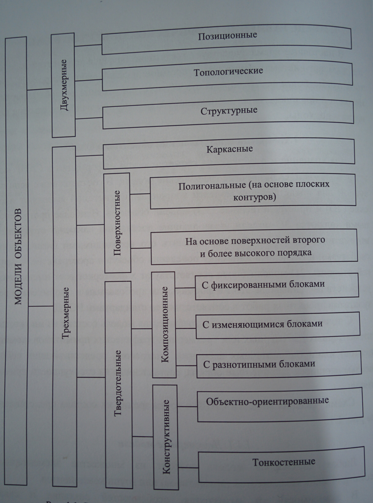

# Вопрос 1: Модели представления объектов в САПР. Двухмерные модели.

Для хранения и отображения геометрической информации в САПР могут использоваться различные графические модели. В соответствии с используемой для представления моделей координатной системой выделяют плоские (2D) и пространственные (3D) модели объектов. Наиболее прогрессивными являются 3D-модели, позволяющие достаточно наглядно отобразить математический образ объекта, наделить его необходимыми физическими свойствами и отследить динамику поведения объекта в пространстве. С другой стороны, 2D-модели более соответствуют характеристикам имеющихся устройств ввода/вывода ЭВМ и формальным требованиям к оформлению результатов проектных работ в соответствие со стандартами ЕСКД.

С точки зрения состава любая графическая модель состоит из множества элементарных двухмерных или трёхмерных графических примитивов (компонентов) и/или библиотечных элементов (макросов), представляющих собой не изменяющиеся законченные образы, составленные из совокупности примитивов.

Двухмерные модели.

Любая двухмерная модель состоит из множества элементарных геометрических компонентов (примитивов) или групп компонентов.

В зависимости от назначения, особенностей создания и связи графических примитивов друг с другом в процессе формирования графических моделей можно выделить позиционные (точечные), топологические и структурные модели изображений.

В позиционных моделях любой геометрический элемент и его положение на плоскости задаются непосредственно через определение значений координат его характерных точек относительно выбранной координатной системы.

Например, отрезок описывается двумя концевыми точками, дуга – тремя (начальной, конечной и точкой положения центра) и т.д. Полная модель объекта представляется в виде множества координат точек. Для модификации модели требуется изменение отдельных координат выбранных элементов.

В топологических моделях геометрические примитивы задаются через ранее определённые элементы. Например, окружность может быть задана как касательная к линии и другой окружности. При этом модель с полной топологией отражает последовательность своего геометрического построения. Для изменения топологической модели можно оперировать более естественными для конструктора величинами, такими, как угол наклона, радиус, расстояние и т.п.

Можно определить положение элементов модели относительно вспомогательных элементов, не являющихся геометрическими составляющими модели. В частности, можно выделить сеточные модели. Здесь элементы привязываются к ортогональной сетке, построенной по координатным точкам геометрических примитивов. Для изменения модели в данном случае необходимо изменять расстояние между указанными вспомогательными линиями. Следует отметить, что и точечные, и топологические, в том числе сеточные, модели актуальны как в 2D-, так и в 3D-пространстве.

Структурные модели представляют собой наборы базовых элементов. Эти модели ориентируются на понятия библиотечного элемента, макроса или сборочного чертежа и часто представляются в виде деревьев.

В практике проектирования часто в двухмерных САПР используется совокупность указанных моделей, т.е. не чисто топологические модели, а смешанные позиционно-топологические модели в совокупности со структурными моделями.

