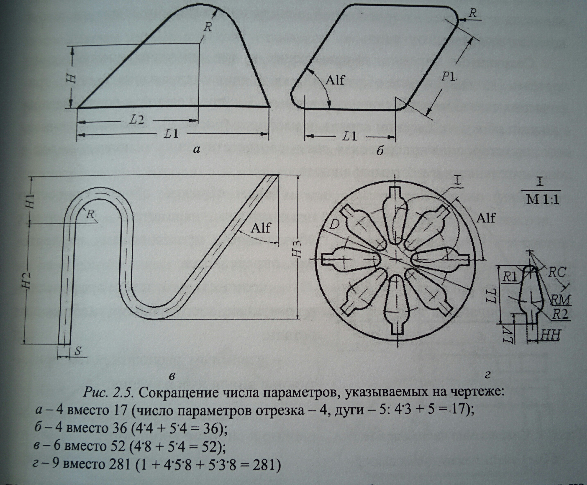

# Вопрос 11: Сокращение числа параметров при параметризации плоских графических фигур.

На конструкторских чертежах параметры изображаемых объектов описываются в ЛСК, начало которой обычно связано с какой-либо точкой каждого вида этого объекта (детали или сборочной конструкции). В результате снижается число параметров, так как положение базовой точки каждого вида не задаётся относительно начала ГСК, которая обычно связана с левой нижней точкой листа чертежа.

Если графическая фигура, представленная на чертеже, состоит из множества не связанных друг с другом примитивов, то общее количество параметров, требуемых для их задания, определяется суммой параметров задания всех примитивов, составляющих изображение. Уменьшить общее количество параметров можно, задав в ЛСК только один графический примитив, с которым эта система непосредственно связана. Для остальных примитивов такой разрозненой фигуры выбранная ЛСК будет выступать в качестве ГСК. Таким образом, общая экономия числа параметров для множества не связанных друг с другом примитивов не может превышать трёх.

В случаях, когда графическая фигура сформирована из связанных друг с другом примитивов, что характерно для эскизов и чертежей деталей, количество параметров, определяющих форму изображаемой фигуры, сокращается за счёт условий связи между этими примитивами и ограничений, накладываемых на эти связи.

Так условие совпадения характерных точек у двух графических примитивов сокращает два параметра, каждое условие касания элементов, параллельности отдельных отрезков друг друг, а также условие перпендикулярности одного элемента другому экономит по одному параметру. Параллельность отрезка оси X или Y тоже уменьшает потребность в определяющих параметрах на единицу, так как размер по соответствующей координате для одной, начальной, точки отрезка совпадает с размером для другой, конечной, точки. Равенство значений какой-либо координаты X и/или Y для несовпадающих точек, принадлежащих разным примитивам, также сокращает количество требуемых параметров задания по соответствующей координате на единицу для каждой из таких точек у всех примитивов, за исключением первой из них. Это обусловлено тем, что размер, установленный на точку, действует на все точки с такой же координатой, расположенные в другом месте чертежа.

На чертежах и эскизах не требуется также указывать соответствующие параметры точек примитивов, значения коопдинат для которых равны нулю.

Условие равенства длин нескольких отрезков или дуг, радиусов или диаметров дуг и/или окружностей позволяет указывать параметры только для одного элемента каждой такой группы, т.е. число параметров описания для каждой группы сокращается во столько раз, сколько одинаковых элементов данного типа присутствует в графическом изображении.

Например, для фигуры на рисунке под буквой "а" экономия параметров происходит за счёт использования ЛСК (2 параметра), совпадения четырёх точек у графических примитивов (8 параметров), условия взаимного касания дуги и двух отрезков (2 параметра) и совпадаения с осью абсцисс (параллельности оси) нижнего отрезка (1 параметр).

Осевая симметрия плоской фигуры сокращает число параметров (размерных обозначений) в соответствии с количеством графических примитивов, которые охватываются условием симметрии.

При центральной симметрии количество параметров описания формы такой сложной фигуры также существенно сокращается. В таких случаях общее количество параметров описания определяется формой только одного элемента симметрии, входящего в фигуру, и двумя дополнительными параметрами – параметром, определяющим общее количество элементов центральной симметрии, а также углом наклона первой (начальной) оси по отношению к одной из осей координат.

При формировании массива однотипных элементов элементов экономятся параметры, которые задают собственные параметры элементов массива и координаты их положения, так как они задаются косвенно через параметры первого элемента и значений их приращений, а также видом формируемого массива и количеством элементов в нём.

Сокращение параметров происходит и при описании межвидового чертежа. Это сокращение обеспечивается за счёт поддержания жёстких графических связей между основными видами. Так виды сверху и снизу связаны с видами сбоку – слева или справа, и наоборот.

Также обеспечивается двухсторонняя графическая связь соответствующих основных видов с дополнительными и местными видами.

Таким образом, общее количество независимых параметров (размерных обозначений), представляемых на чертежах, определяется:

- количеством и типом графических примитивов, составляющих изображения детали;
- взаимным расположением примитивов и видов изображения;
- положением примитивов по отношению к системе координат;
- постоянством толщины сечения;
- наличием осевой или центральной симметрии в фигуре;
- наличием массивов однотипных элементов.

Благодаря технологии сокращения параметров, проставляемых на чертежах, уменьшается сложность формируемых изображений, а главное, упрощается процесс восприятия человеком изображаемых объектов. Если бы сокращение не производилось, то за множеством установленных на чертеже размерных обозначений человеку было бы трудно распознавать сам конструкторский объект, представленный на таком чертеже.

