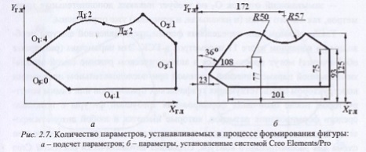
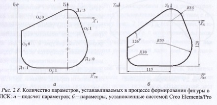
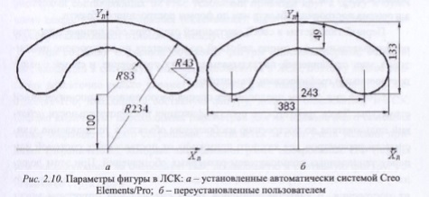

# Вопрос 12: Параметризация плоской фигуры в процессе ее создания
  В ходе конструирования фигуры ее параметризация может осуществляться автоматически, когда система параметризации сама определяет количество и типы размерных обозначений, которые необходимо нанести на изображение для однозначного определения формы фигуры. В этом случае система осуществляет так называемую параллельную параметризацию, при которой прорисовка графических примитивов конструктором параллельно сопровождается автоматической установкой системой независимых соответствующих размерных обозначений на формируемое изображение.
Обычно до начала процесса конструктор представляет себе форму фигуры или имеет ее эскиз. В результате конструирования должно быть построено геометрически и параметрически правильное изображение, позволяющее воспроизвести эту фигуру с заданными размерными значениями независимо от алгоритма ее создания, т. е. с точностью до формы фигуры. Этот процесс параметризации можно описать достаточно формально. Для иллюстрации рассмотрим несколько относительно простых примеров.

# Пример 1. 
Замкнутая фигура представлена в ГСК и состоит из двух сопряженных друг с другом дуг и пяти последовательно соединенных отрезков. При этом один отрезок (O_1) касается своим концом первой дуги, а второй (О_2) проведен перпендикулярно второй дуге в конечной ее точке.

  Количество параметров, необходимых для полного задания формы такой фигуры в ГСК, можно найти сложением числа параметров, требующихся для определения каждого графического примитива фигуры в процессе ее построения:
- для определения отрезка О_1 требуется 4 независимых параметра (например, для задания координат точек его начала и конца);
- дуга в общем случае, и в частности дуга Д_1 требует для своего описания пяти параметров.
  Однако точка первой дуги Д_1 совпадает с конечной точкой отрезка О_1 и за счет их совпадения система экономит 2 параметра. Кроме того, так как дуга является касательной к отрезку О_1, то для ее описания не требуется устанавливать еще один параметр. Таким образом, дуга Д_1, для своего определения в фигуре требует только двух параметров (5-2-1 2 ); 
- дуге Д_2, сопряженной с первой, для описания необходимо тоже только 2 параметра (совпадение ее точки начала с конечной точкой первой дуги и условие касания дуг экономит 3 параметра); 
- отрезок О_2, перпендикулярный дуге Д_2 в её конечной точке, может быть полностью описан одним параметром (экономия двух параметров обеспечивается за счет совпадения точек дуги и отрезка, а третьего параметра - за счет условия перпендикулярности этих элементов друг другу); 
- отрезок О_3 также описывается лишь одним параметром, так как он вертикальный (параллелен оси ординат) и его начальная точка совпадает с конечной точкой предыдущего отрезка; 
- горизонтальный отрезок О_4, связанный с предыдущим, также для своего полного описания в данной фигуре требует одного параметра;
- замыкающий отрезок О_5 не требует никаких дополнительных параметров, так как его точки (и начальная, и конечная) уже определены.

Таким образом, для определения формы представленной фигуры необходимо в конечном итоге 11 параметров в ГСК. Эти параметры (размерные обозначения) могут проставляться в автоматическом режиме самой автоматизированной параметрической системой при последовательном построении конструктором соответствующих графических примитивов или самим конструктором после окончания формирования требуемой фигуры с помощью средств формирования размеров, которые имеются в любой автоматизированной системе конструкторского проектирования. В частности, размерная схема для рассмотренного контура, созданная автоматически системой Сгео Elements/Pro, представлена на рис. 2.7, б. Следует отметить, что в параметрических системах обычно в автоматическом режиме осуществляется простановка наиболее очевидных размеров.Так: 
- линейные размеры (вертикальный, горизонтальный и наклонный или параллельный) устанавливаются на отдельную точку, точки начала и конца отрезка и дуги, точки ломаной линии, центр окружности, эллипса, а также полуоси эллипса. Такие размеры ставятся относительно начала координат, а при отсутствии осей относительно начального (первого нарисованного) отрезка или относительно предыдущей, уже поставленной или уже определенной (образмеренной) в поле изображения точки. При определении полуосей эллипса линейные размеры устанавливаются относительно его центра;
- на окружности всегда ставятся диаметральные размеры;
- на дугах всегда один из устанавливаемых на них размеров является радиальным;
- угловые размерные обозначения устанавливаются на отдельный наклонный отрезок и между соседними отрезками ломаной, если они не взаимноперпендикулярны и не параллельны осям.
Следует отметить, что в различных системах алгоритмы автоматической установки размерных обозначений несколько отличаются. Кроме того, схема простановки размеров в конкретной САПР может меняться в зависимости от последовательности рисования элементов плоской фигуры, а также в процессе ее построения по мере добавления в фигуру новых графических примитивов.
# Пример 2.
Фигура, представленная на рис. 2.8, а, для своего описания в ЛСК, которая связана с дугой Д_1 требует установки шести размерных обозначений.

Убедимся в этом. Так, если обходить представленный контур по часовой стрелке и начать с верхней дуги окружности Д_1 то для полного описания этого сегмента требуется 3 параметра (например, значение радиуса и значения координат У для начальной и конечной точек этой дуги). Для задания следующего за этой дугой отрезка О_1 касающегося ее, требуется только один параметр - например, длина этого отрезка или значение проекции его длины на ось Y_а. Для задания дуги Д_2, касающейся этого отрезка, не требуется ни одного параметра, так как центр этой дуги и ее конец находятся на оси ординат ЛСК. На задание очередного горизонтального отрезка О_2, как и на последующую дугу Д_3, необходимо установить по одному параметру (длина отрезка и радиус дуги, которая составляет четверть окружности). Остается только 
определиться с двумя оставшимися отрезками - со следующим за дугой вертикальным отрезком О_3, а также с замыкающим рассматриваемый контур отрезком О_4. Для задания обоих отрезков не требуется ни одного дополнительного параметра. Так, во-первых, конечная точка замыкающего отрезка О_4 определена и совпадает с начальной точкой дуги Д_1 (отрезок является касательным к этой дуге), а, во-вторых, его начало соответствует координате X конечной точки дуги Д_3, т. е. его положение и так полностью определено. По этому полностью определено и положение предыдущего вертикального отрезка О_3. На рис. 2.8, 6 представлена размерная схема, которая автоматически сформирована системой Creo Elements/Pro для такой фигуры. В этой системе при параметризации рассмотренной фигуры, как можно убедиться, установлено именно 6 независимых параметров.
# Пример 3. 
  В этом примере представлен кулачок - симметричная фигура, составленная из четырех сопряженных друг с другом дуг, две из которых (Д_2 и Д_4) равны между собой (рис. 2.9). Для полного определения формы этой фигуры в ЛСК, как ни удивительно, требуется всего 4 параметра, в чем относительно легко убедиться. Пусть ЛСК связана с центром окружности первой, верхней, дуги Д_1 и ее ось ординат совпадает с осью 
симметрии фигуры. Для задания параметров этой дуги, как известно, в ЛСК достаточно двух параметров - значений радиуса и одной координаты любого ее конца (X или Y). Для определения любой из двух одинаковых дуг Д_2 и Д_4, касательных к первой, требуется 2 параметра, так как при задании такой дуги экономится 3 параметра - за счет условия совпадения точек и условия сопряжения с предыдущей дугой. Вместе с тем, так как эти дуги одинаковы (фигура симметрична относительно оси Y), то на определение второй из них не требуется ни одного параметра.
Замыкающая дуга Д_3 для своего задания не требует ни одного дополнительного параметра - ее конечные точки уже определены в результате задания параметров дуг Д_2 и Д_4, и, кроме того, на ее концы накладываются условия сопряжения с этими дугами. 

На рис. 2.10, а представлена размерная схема, которая автоматически формируется системой Сгео Elements/Pro при построении эскиза рассмотренного кулачка. При этом система позволяет пользователю в соответствии с его пожеланиями изменить размерную схему (рис. 2 .1 0, б) с сохранением целостности параметрической модели этого объекта, т. е. с сохранением возможности автоматической перерисовки изображения объекта при изменении значения любого одного из установленных размеров или даже всех их в совокупности. Следует помнить, что пользователь при замене параметров, заданных системой по умолчанию, на собственные размерные обозначения должен обеспечить независимость вводимых им новых размерных обозначений друг от друга.
  С другой стороны, параметрическая система должна сохранить в своей внутренней структуре информацию о параметрической цельности описания объекта. Иными словами, средства модификации изображения при задании новых значений параметров в этом описании должны безусловно перерисовать объект в соответствии с новыми, но непротиворечивыми по значениям, параметрами. Т. е. во внутренней структуре системы описание объекта должно быть выполнено не с точностью до алгоритма его построения, от которого зависит совокупность автоматически установленных в чертеже размерных обозначений, а с точностью до формы объекта, которая определяется достаточной совокупностью поставленных размерных обозначений, а не их конкретным типом. В связи с этим все системы конструкторской автоматической параметризации могут быть разделены на системы с параметризацией с точностью до алгоритма построения объекта или до формы построенного объекта. Первый тип систем в своей внутренней структуре обеспечивает простую последовательную фиксацию действий пользователя по построению примитивов, учет ограничений, накладываемых на их построение, и связей с ранее построенными графическими элементами. Второй тип систем предполагает специальную организацию внутренней структуры. Здесь требуется не простая фиксация последовательности действий пользователя по построению изображения объекта, а установление зависимости параметров для каждого примитива от поставленных системой или 
переустановленных пользователем размерных обозначений. При этом должны учитываться все ограничения, накладываемые на примитивы в процессе их построения. В качестве примеров такой специальной структуры могут служить: 
- средства, обеспечивающие вычисление заменяемого размерного обозначения через вновь вводимый замещающий размер. При этом в большин
стве случаев для такого вычисления приходится использовать и другие размерные обозначения, автоматически установленные системой на чертеже (эскизе). Вместе с тем такая система, по сути, остается системой параметризации с точностью до алгоритма построения - она обеспечивает модификацию параметризованного объекта в соответствии с его алгоритмом построения, так как в ее структуре данных устанавливается однозначная функциональная связь “старого” размера, автоматически поставленного системой, со значением, вновь установленным пользователем;
- базовая сетка чертежа (эскиза) объекта с наложенной на нее размерной сеткой.
