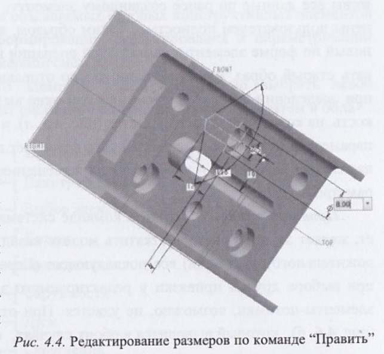
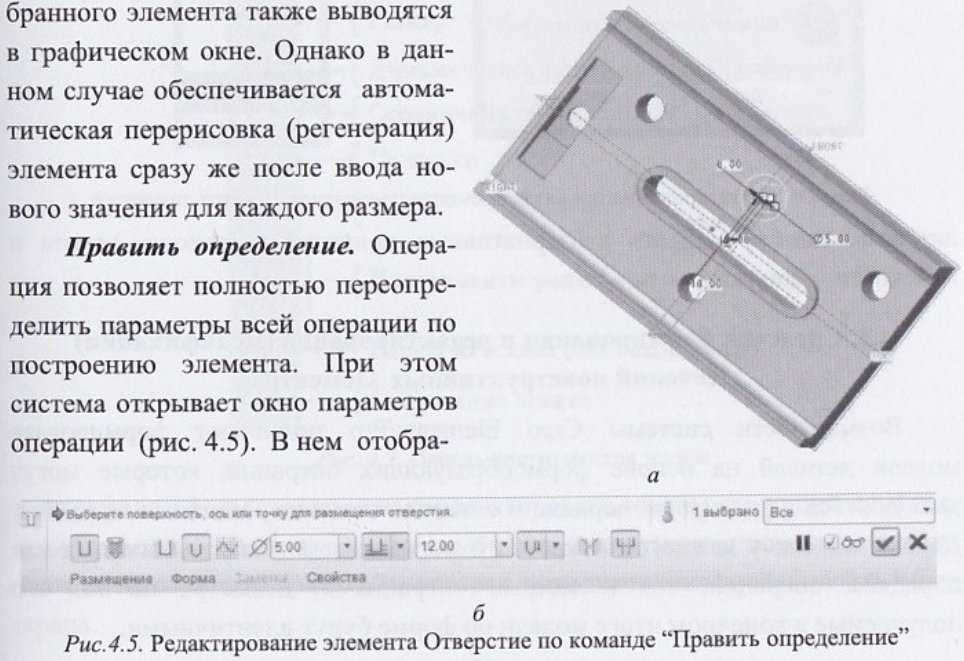
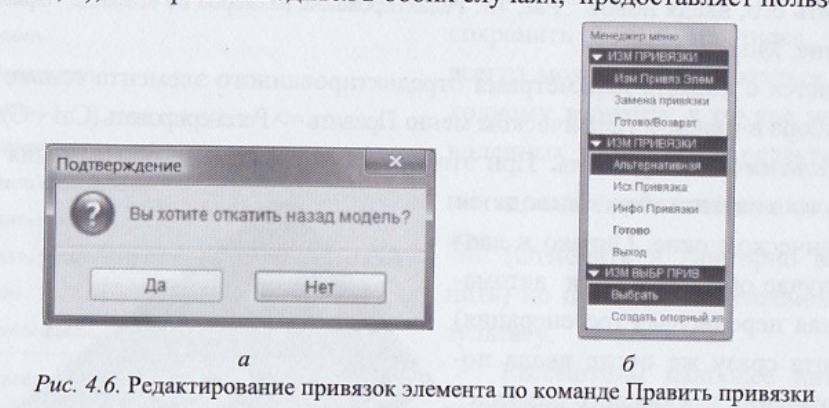

# Вопрос 17: Средства редактирования и модификации объектов 3D-систем параллельной параметризации. Дерево модели (чертежа).

## Дерево модели (чертежа)

В ней отражается все операции по построению модели детали (чертежа, схемы и т.п.) в последовательности их выполнения. С помощью этих средств, контструктор может получить информацию о порядке операций по формированию модели, изделия и представить, какая отдельная объемная часть, входящая в модель, строится на основе другого, построенного ранее объемного примитива.

С помощью дерева обеспечивается функция редактирования и модификации кождой из состовляющих форм модели детали. Редактирование и модификация сводится к действиям над операцией, с помощью которой этот элемент был создан.

## Средства редактирования и модификации

### Удаление

Команда удаляет не только выбранный элемент, но и его потомков - элементов построенных на основе выбранного. Для восстановления элементов нужно воспользоваться командой Отменить.

### Править

Команда служит для редактирования управляющих размеров и параметров выбранного элемента. После того, как пользователь в графическом окне произвел изменения, модель перерисовывается с новыми параметрами только после выбора команды Править => Регенерировать.

### Динамически Править

Аналогична команде Правка, только модель перерисовывается автоматически.

### Править определение

Команда позволяет полностью переопределить параметры всей операции по построению элемента. В окне параметров отображены все данные по ранее созданному элементу, которые могут быть полностью изменены.

### Править привязки

1. Запрашивается подтверждение отката модели назад.
2. Если Да, то все последующие операции блокируются, так как если выбрать другую привязку у редактируемого элемента, то перерисовать эти элементы-потомки, возможно, не удастся.
3. Если Нет, то предоставляется выбор альтернативной привязки (плоскость эскиза и плоскость привязки).

