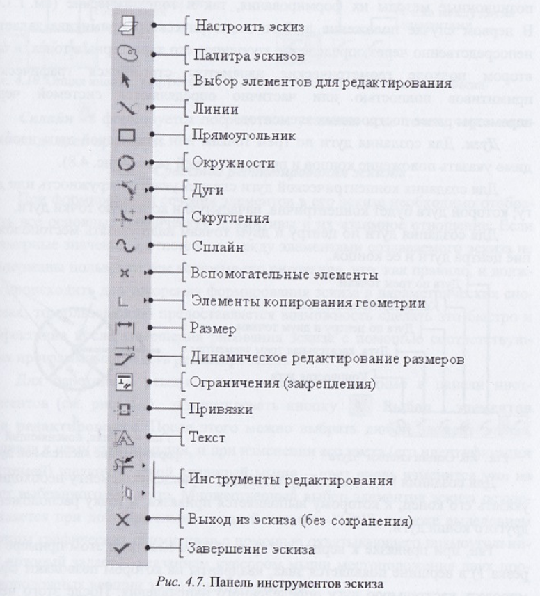
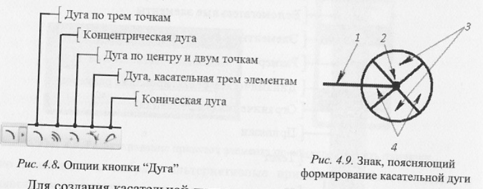
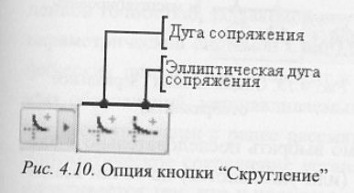

# Вопрос 18: Средства формирования и редактирования (модификации) сечений конструктивных элементов.

Возможности системы позволяют формировать детали на основе формообразующих операций, которые могут выполняться в различном порядке и с использованием различных способов. Дерево модели у каждого пользователя может отличаться как порядком операций, так и самими операциями, но в итоге модели по форме будут идентичными.

Большинство базовых конструктивных элементов системы основываются на формировании, редактировании и параметризации эскизов их сечений в двумерной системе.

Для создания элемента эскиза нужно:
1. Выбрать левой кнопкой мыши инструмент рисования или редактирования
+ В области графики сформировать или отредактировать соотв. графический примитив.

В процессе формирования графических примитивов используются как позиционные методы (положение геом. примитива задается непосредственно через определение координат его характерных точек) их формирования, так и топологические (геом. параметры полностью или частично определяются системой через параметры ранее созданных элементов).

## Дуги

Для создания дуги по трем точкам или конкретной дуги необходимо указать положение концов и промежуточной точки.

Для создания концентрической дуги следует указать окружность или дугу, которой дуга будет концентрична, начальную и конечную точки дуги.

Для создания дуги по центру и двум точкам надо указать местоположение центра дуги и ее концов.

Для создания касательной дуги к существующему элементу необходимо указать его конец, к которому выполняется привязка, и точку расположения другого конца дуги.

## Скругление

Круговое и эллиптическое скругления выполняются при выборе двух существующих графических элементов.

## Фаска

Нужно выбрать 2 примитива. В случае фаски с созданием конструктивных линий на месте отсеченных фаской частей примитивов добавляются конструктивные линии.

## Сплайн

Формируется посредством указания всех точек, через которые он должен проходить.
