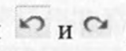
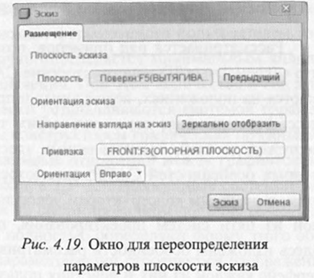

# Вопрос 22. Средства управления положением и масштабом модели в CreoParametric

**Управление ориентацией и масштабом модели.** При формировании трехмерных геометрических моделей для визуальной оценки результатов ге­нерирования базовых операций приходится представлять изображение, вы­водимое на экран, в наиболее удобном для пользователя виде. Для этого не­обходимо уметь перемещать модель, поворачивать в пространстве и изме­нять масштаб ее представления. Все эти действия могут выполняться с по­мощью клавиш мыши и клавиатуры (таблица).

**Функции управления ориентацией и масштабом модели**

Функция над изо­бражением модели | Комбинация клавиш мыши и клавиатуры | Примечание
------------ | -------------
Вращение | Нажатая средняя клавиша мыши (колесо) | Вращение модели происходит относи­ тельно начала координат при переме­ щении курсора мыши
Перемещение | “Shift” + нажатая средняя клавиша мыши (колесо) | Перемещение модели происходит при перемещении курсора мыши
Поворот |  “Ctrl” + нажатая средняя клавиша мыши (колесо) | Поворот модели вокруг точки исходно­ го положения курсора против / по часо­ вой стрелке при перемещении мыши влево / вправо
Изменение мас­штаба | Вращение колеса мыши | -
Плавное масшта­ бирование | “Shift” + вращение колеса мыши | -
Грубое масштаби­ рование | “Ctrl” + вращение колеса мыши | -

**Обеспечение возврата к исходной ориентации эскиза и модели.** При формировании сечений плоскость эскиза часто несколько разворачивается в пространстве относительно плоскости экрана. Вернуть эскиз в исходное по­
ложение кнопками  (Отменить и Повторно выполнить) не всегда удается. В то же время сформировать правильное сечение в полученных про­извольных положениях затруднительно или даже невозможно. В таких слу­чаях следует воспользоваться одним из двух вариантов выбора соответст­вующих функций главного графического меню системы.

Первый вариант требует последовательного выбора следующих функ­ций:

Вид => Ориентация => Ориентация эскиза (или Предыдущая ориента­ ция, если надо вернуть объект в предыдущее положение). В результате плос­ кость эскиза развернется и совпадет с плоскостью экрана.

При втором варианте следует выбрать: Эскиз => Настроить эс­киз. При этом будет выведено ок­но задания параметров эскиза (рис. 4.19), в котором по умолчанию выводятся параметры привязки плоскости эскиза. Их можно при­нять, нажав кнопку Эскиз, или пе­реопределить любой параметр по желанию пользователя.

> Страница 78-79 методички
