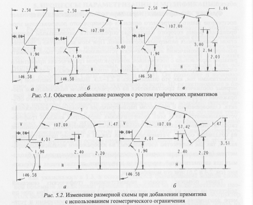

# Вопрос 23: Параметризация и модификация эскизов при формировании базовых объемных элементов. Основные функции систем параметризации.

В основе процесса формирования модели сложной обхемной детали лежит принцип ее создания на основе достаточно простых базовых объемных непроизводных примитивов. Конструктор мысленно разбивает необходимую для моделирования объемную деталь на простые составляющие, отдельные модели, которые затем последовательно формирует и скомпоновывает, для получения требуемой конструкции. При этом уже на начальном этапе проектирования отдельных объемных составляющих модели деталей 3D-параметрические САПР сразу же создают параметрическое описание формируемой части, начиная с параметризации сечения создаваемого на его основе базового объемного примитива.

## Основные функции систем параметризации

#### Функция формирования параметрического описания

Обеспечивает построение такого внутреннего описания формируемого пользователем изображения, форма которого однозначно определяется минимальным количеством независимых размерных обозначений. При этом количество и тип этих размерных обозначений автоматически устанавливается системой параметризации параллельно с построением конструктором графических примитивов сложного изображени с учетом взаимных отношений между графическими примитивами. Выявленные системной размерные обозначения представляются на сформированном пользователем изображении и полностью определяют форму этого объекта. ОДновременно с процессом параметризации строящегося изображения устанавливаются связи всех геометрических параметров каждого графического примитива с размерными обозначениями(параметрами), нанесенными на созданный объект. Установлене этих связей в системе параметризации важно, т.к количество поставленных на изображении независимых параметров существенно меньше количества параметров, необходимых для автоматической перерисовки примитивов.

Таким образом, процесс параметризации графических описаний действует на этапе их формирования конструктором. при этом по мере дополнения изображения новыми графическими примитивами и установления новых взаимных отношений между ними создаваемое параметрическое описание может иногда несколько изменятся. Имеется в виду, что в размерную схему не просто добавляются новые размеры, определяющие параметры параметры очередного сформированного пользователем примитива, а изменяется тип размерных обозначений, поставленнных системой на ранее сформированные примитивы. Пример на рисунке.

#### Функция модификации

Обеспечивает автоматическую перерисовку созданного параметрического графического объекта при изменении каокго-либо типа ограничения, накладываемого на элементы изображенного объекта. Наиболее часто для модификации моделей используют изменения размерных и топологических ограничений, но иногда применяют функционалные и логические. Так модификация параметрической модели объекта производится при изменении значения одного или всех определяющих форму этого объекта размерных обозначений, если новые задаваемые значения не противоречат друг другу. Работа этой функции обеспечивается тем, что во внутренней структуре параметрических сисистем конкретные параметрых всех графических примитивов, необходимые для их перрерисовки с новыми значениями, представлены в зависимости от араметров, используемых в сформированном параметрическом описании.

Модификация изображений может обеспечиваться параметрическими системами как на уровне сечений базовых объемных графических примитивов, так и на уровне их 3D-представления
