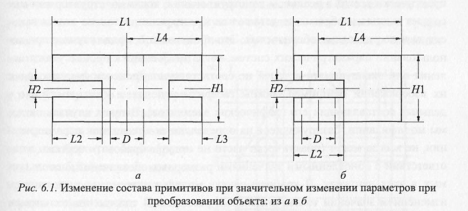

# Вопрос 21:Проблемы при создании систем последующей параметризации (параметризации конструкторских чертежей).

Обратимся, прежде всего, к основным проблемам, которые необходимо
преодолеть при решении задачи параметризации. Кратко они определяются:
1. Большим разнообразием графических элементов, составляющих чертеж,
множеством способов и произвольностью порядка построения этих элементов.
2. Наличием многообразных элементов оформления.
3. Заданием геометрических параметров графических элементов в различных
координатных системах (прямоугольной, полярной и смешанной).
4. Многовидовым представлением детали (объекта) на чертеже. При
этом в чертеже могут присутствовать как основные вцды, так и дополнительные.
5. Неявным заданием геометрических параметров для большинства графических
примитивов, в том числе и из-за распределения по отдельным видам
размерных обозначений, задающих форму объекта при использовании
многовидовых чертежей.
6. Возможным изменением состава графических примитивов чертежа при значительных изменениях параметров (значений размеров).

#### Разнообразие графических элементов и способов их построения

Элементы чертежа можно условно разделить на 3 главные группы: геометрические
(основные) элементы, элементы оформления и вспомогательные
элементы чертежа.
Основные геометрические элементы или графические примитивы (точки,
отрезки, дуги, окружности, полилинии и т. п.) используются для создания
формы объекта.
Элементы оформления (макросы или ассоциативные элементы, к которым
можно отнести различные технологические обозначения, технические
требования, области штриховки и даже форматы и основные надписи и т. д.)
применяются для задания конструкторских и технологических характеристик
детали, изображенной на чертеже.
К вспомогательным элементам можно отнести оси различного вида (отрезки,
дуги и окружности) и размерные обозначения. Размеры определяют
параметры конкретной формы, а различные оси служат для упрощения графического
представления, уменьшения необходимого количества устанавливаемых
размеров и лучшего понимания изображенной на чертеже реальной
детали.

**Основные геометрические элементы могут** быть построены двумя различными
методами: произвольным и вычислительным. Произвольный метод
включает способы построения, при которых пользователь в процессе работы
непосредственно указывает координаты характерных точек и скалярные параметры
геометрических примитивов, т. е. пользователь произвольно или,
другими словами, “вручную” строит элемент чертежа. Вычислительный метод
объединяет способы построения геометрических примитивов с использованием
функций, предварительно вычисляющих параметры этих строящихся
примитивов. При этом пользователь должен выбрать один из возможных
вариантов построения примитива, указать элементы, на основе которых
он будет строиться, а при необходимости, ввести дополнительные параметры.
При этом координаты всех характерных точек автоматически строящегося
примитива определяются через параметры ранее созданных элементов.

**Элементы оформления** чертежа представляются в виде макросов
(обобщенных графических примитивов), которые определяют конструктивные
и технологические характеристики представленной детали. В процессе
101
формирования чертежа для этого используют либо библиотечные элементы,
либо макросы, которые создаются программно. Параметры подобных элементов
чертежа можно разделить на внешние и внутренние. Внешние параметры
элемента оформления определяют конкретную схему его привязки к
соответствующему основному элементу изображения и собственную геометрию.
Внутренние пара,штры отражают содержательную информацию, определяющую
требования к конструкции или технологии изготовления.

**Вспомогательные примитивы**, такие, как оси, с точки зрения построения
параметрической модели характеризуются только внешними параметрами,
а размеры, помимо внешних параметров привязки - еще и конкретными
значениями.
Элементы оформления и вспомогательные элементы чертежа ассоциативно
привязаны к основным геометрическим элементам чертежа. Следовательно,
они не должны непосредственно включаться в параметрическую модель
чертежа детали. Они наносятся на чертеж после модификации основного
изображения в соответствии с логикой привязки к тем основным геометрическим
примитивам, с которыми они были связаны в исходном описании.
В связи с этим можно разработать универсальную процедуру модификации
таких элементов. Данная процедура должна только определять параметры
привязки - координаты точек привязки и углы наклонов элементов оформления
и вспомогательных элементов, а затем применять средства подсистемы
генерации для вычерчивания изображения таких элементов и макросов.
В рамках задачи параметризации чертежа особое значение имеют размерные
обозначения. С одной стороны размерные обозначения сами являются
элементами изображения, а с другой - задавая конструктивные размеры
изделия, полностью определяют параметры изображенного графического
объекта. Однако параметризованное изображение чертежа и параметрическая
модель чертежа — различные понятия. Параметризованное изображение
представляет собой графический образ объекта, выполненный по определенным
правилам и содержащий отображенные в нем геометрические характеристики,
позволяющие физически произвести представленный объект. Пара.иетрическая
модель чертежа включает в себя формализованное описание
всех графических примитивов, составляющих чертеж, геометрические характеристики
которых должны быть представлены в описании через используемые
в чертеже размерные обозначения. Это описание позволяет автоматически
модифицировать все изображение в соответствии с новым набором раз1
0 2
мерных значений, заданных конструктором.
Отмеченные две стороны характера размерных обозначений позволяют
использовать их как главное средство, необходимое для построения параметрической
модели. Следует отметить, что размерные обозначения определяют
параметры не только графических примитивов изображения, но и самих себя.
Размерные обозначения, определяя размерную сеть чертежа, определяют и
свои собственные точки привязки к элементам объекта, и свою геометрическую
форму. Таким образом, переопределенные в ходе модификации точки
привязки размерных обозначений могут быть использованы и для перестроения
изображения размерных обозначений с учетом ограничений ЕСКД.
Оси как вспомогательные элементы чертежа в процессе параметризации
занимают промежуточное место между геометрическими элементами и элементами
оформления. С одной стороны, некоторые вспомогательные элементы
служат для создания основного изображения, а с другой - упрощают
формирование изображения и сокращают количество размерных обозначений,
необходимых для определения формы объекта. Поэтому параметризация
вспомогательных элементов может осуществляться как через размерные
обозначения, так и при помощи условий привязки и условий построений.
Таким образом, процедуры модификации размерных обозначений, элементов
оформления, а также вспомогательных элементов должны быть подобны
процедурам модификации элементов, построенных в соответствии с
их способами формирования. В общем случае элементы оформления и вспомогательные
элементы чертежа строятся на основании параметров уже существующих
элементов.
Важным моментом при модификации элементов оформления является
то, что при существенных изменениях основного изображения чертежа может
потребоваться изменение как содержательной информации в элементах
оформления, так и схем простановки самих элементов оформления. Содержательная
информация может быть полностью или частично изменена автоматически.
Например, может изменяться информация, которая должна отражаться
в тексте элемента обозначения шероховатости. При изменении размеров
могут изменяться значения их допусков при сохранении их квалитетов.
Однако изменить схему простановки элемента оформления можно только
при участии конструктора. В противном случае параметрическая модель
должна включать в себя четкое определение способов простановки вспомогательных
элементов для любого сочетания параметров и любой конфигура103
ции изображаемого объекта. На данном этапе развития САПР сделать это не
представляется возможным, в связи с чем создавать такие средства желательно,
но нецелесообразно. Однако при необходимости процедуру модификации
элементов оформления легче организовать так, чтобы она указывала
конструктору, какие элементы требуют изменения схемы простановки и интерактивной
доработки.

####  Задание параметров в различных системах координат

Возможность задания параметров в различных системах координат
(прямоугольной, полярной или смешанной) также является проблемой параметризации,
так как это существенно увеличивает количество вариантов задания
параметров и, соответственно, усложняет их анализ.
С усложнением графического объекта количество вариантов простановки
размеров быстро возрастает.

####  Многовидовое описание объектов в чертеже

Использование нескольких видов обусловлено необходимостью показать
на плоскости все особенности геометрии объемного объекта. Такое
представление может включать в себя до шести основных и ряд дополнительных
видов, в которых отображаются сечения, разрезы и выносные элементы.
Кроме того, в чертеж включаются надписи, технические требования и
таблицы. Все перечисленные элементы распределяются по всему полю чертежа,
и связь между ними оказывается достаточно условной, что существенно
затрудняет создание параметрической модели такого чертежа.

####  Неявное задание геометрических параметров

Построение графических примитивов на основании условий их отношения
к ранее созданным элементам чертежа внешне выражается в сокращении
числа указываемых (устанавливаемых) размерных обозначений. В то же время,
параметрическая модель должна содержать все геометрические параметры
для каждого графического примитива. На чертеже для упрощения его
создания и восприятия сокращается множество параметров, определяющих
геометрические характеристики графических примитивов. Это происходит
тогда, когда какой-либо из параметров в том или ином представлении
не меняется. Например, если приращение по одной из координат будет
равно нулю. В таких случаях соответствующий параметр
обращается в нуль и его можно считать заданным неявно. Для отрезка вари104
анты неявного задания соответствуют условиям параллельности отрезка одной
из осей координатной системы или связности с другими графическими
примитивами. В общем случае необходимо выделять также условия, определяемые
выбранной координатной системой, относительно которой строится
чертеж. Точку начала такой координатной системы называют базовой точкой
чертежа. Если какая-либо характерная точка элемента чертежа принадлежит
либо оси абсцисс, либо оси ординат координатной системы чертежа, то значение
ее соответствующей координаты считается определенным. Таким образом,
подобное условие косвенно определяет один из требуемых параметров
примитива. Аналогичное неявное задание параметров наблюдается и в изображениях,
состоящих из группы графических примитивов, связанных условными
соотношениями. Очевидно, что идеальная система параметризации чертежей
должна выявлять все используемые соотношения между графическими примитивами
изображения, формализовать их и включать в параметрическую
модель.

#### Изменение состава графических примитивов

Данная проблема параметризации чертежей обычно возникает при необходимости варьировать параметры объекта в широких пределах. В такой ситуации
возможно не только изменение параметров графических примитивов,
описывающих объект, но и изменение состава этих примитивов (исключение
105
или добавление их). Наиболее часто встречающийся пример изменения состава
примитивов - удаление некоторых из них в связи с вырождением. Так,
например, если конструктор задает нулевой радиус какого-либо отверстия, то
после модификации на чертеже не должно остаться ни примитива, описывающего
это отверстие, ни самого размера с нулевым значением. Появление
новых примитивов в составе чертежа обычно связано с преобразованиями
объектов сложной формы, которые содержат вырезы и отверстия.
