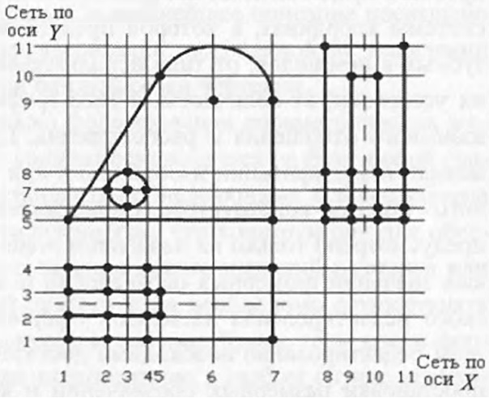

# Вопрос 26: Основы создания систем, обеспечивающих создание параметрических моделей чертежей

В большинстве современных систем из-за простоты реализации параметризация изображений осуществляется параллельно с
созданием чертежа. В соответствии с таким подходом параметризация осуществляется, как говорят, с точностью до алгоритма
построения изображения. Это означает, что размерные обозначения, используемые на чертеже, строго соответствуют алгоритму
его построения. Соответственно и модификация такого чертежа происходит согласно способу его первоначального построения.

К сожалению, в системах без автоматической параметризации создаваемого описания из-за разнообразия способов формирования
изображений (алгоритмов их построения) и множества вариантов установки на чертежах размерных обозначений (алгоритмов
параметризации) эти алгоритмы (построения и параметризации) могут не соответствовать друг другу. Это случается практически
всегда в реальном конструировании, когда конструктор вначале создает полное изображение детали или конструкции, а только
потом наносит на него размерные обозначения. Это происходит и в ряде случаев при использовании параметрических систем, когда
требования к процессу изготовления или эксплуатации деталей не соответствуют процессу формирования их изображений (например,
важны габариты изделия, а не параметры отдельных составляющих его графических элементов). В таких случаях системы
модификации, базирующиеся на определенных алгоритмах параметризации, не всегда могут (практически часто не могут) обработать
чертежи в соответствии с обновленными значениями размерных обозначений, используемых в этих чертежах. В крайнем случае
модификация может выполняться изменением значений только отдельных размеров. В современных систкемах нельзя автоматически
модифицировать изображения, алгоритм построения которых не связан с размернымт обозначениями, установленными на этом
изображении.

Модификация, основанная на использовании метода аналитическосинтетической параметризации (MAC-параметризации), который
обеспечивает создание системы последующей параметризации, не связана ни с каким алгоритмом построения изображения.
Поэтому системы, построенные на ее основе, способны обрабатывать ранее созданные непараметрические чертежи. При их
использовании не возникает проблем, присущих существующим системам. Здесь анализируются размерные обозначения,
используемые в текущем чертеже, и устанавливается параметрическая связь для всех графических примитивов чертежа в
зависимости от используемых в нем размерных обозначений и выявленных связей между отдельными графическими примитивами
и видами чертежа.

В основу установления связей между всеми графическими элементами чертежа может быть положена опорная (базовая) сетка
чертежа. Под такой сеткой понимается нерегулярная прямоугольная координатная сетка по осям Х и Y, узлы которой
определяются положением всех характерных точек (начала, конца отрезков, излома линий, центра дуг и окружностей, точек
пересечения, касания, привязки и т. д.) всех основных графических примитивов, составляющих чертеж (рисунок). Таким
образом, устанавливается однозначная связь каждой характерной точки примитивов изображения с парой элементов сетки
(горизонтальным, обозначаемым X_i ,и вертикальным - У_j, которые можно рассматривать в качестве имен этих элементов сетки).
При этом для каждого элемента сетки можно определить хотя бы один узел, которому можно сопоставить характерную точку
одного или нескольких графических примитивов изображения. Таким образом, изображение детали оказывается  связанным с
этой сеткой, или как бы вписанным в нее.

В то же время наличие такой базовой сетки и размерных обозначений, используемых в чертеже, позволяет сформировать
размерную сетку, в которой устанавливаются функциональные или количественные связи соответственно через имена или
значения используемых размерных обозначений между всеми элементами базовой сетки.

Полное описание связей между элементами базовой сетки, выраженное через имеющиеся размерные обозначения, позволяет
перестроить (перерисовать) такую базовую сетку в соответствии с новыми значениями размеров и перерисовать изображение на
чертеже в соответствии с этими значениями, т. е. модифицировать чертеж согласно новым значениям размеров.

Таким образом, базовая сетка чертежа, для элементов которой установлены функциональные или количественные связи через
размерные обозначения, совместно с файлом описания чертежа представляет параметрическую модель чертежа, которую можно
использовать для его успешной модификации. Система, которая обеспечивает автоматическое построение такой параметрической
модели чертежа с последующей его модификацией в соответствии с новыми значениями размеров, и является, по сути, системой
последующей парамегризации чертежей.

Использование опорной сетки чертежа облегчает определение связей между ее элементами, т. е. создание размерной сетки и,
в совокупности, параметрической модели чертежа. При этом процесс создания параметрической модели оказывается унифицированным
и практически независимым от конкретного представления изображенной на чертеже детали. Он не зависит от системы координат,
в которой представлен чертеж, от количества используемых в нем видов, от типа используемых размерных обозначений и места
их установки, от количества и типа графических примитивов и условий их взаимного отношения и расположения. Процесс создания
параметрической модели и модификации изображений при таком подходе требует минимального участия конструктора (пользователя).
Вмешательство конструктора предусмотрено только на начальном этапе для задания (ввода в систему) новых значений размерных
обозначений и на заключительном - для графического редактирования элементов оформления построенного чертежа. При этом
редактирование необходимо достаточно редко - для изменения схемы простановки размерных обозначений и коррекции внутренних
параметров (данных) технологических обозначений. Однако эти операции достаточно просто автоматизировать, чтобы они не
требовали много времени и усилий от конструкторов.

Система последующей параметризации чертежей (система на основе МАС-параметризации) может быть реализована в двух вариантах,
в которых параметрическая модель представляется в виде:
- функциональных зависимостей между элементами размерной и базовой сеток, которые представляются в виде различных функций
от имен размерных обозначений чертежа;
- численных связей между элементами размерной и базовой сеток, которые определяются новыми значениями размерных обозначений
чертежа и соответствуют желаемой форме модифицированного объекта.

Первый вариант позволяет единожды построить параметрическую модель чертежа и использовать ее многократно для получения
семейства модифицированных объектов. Однако для реализации этого варианта необходимо иметь и хранить 2 связанных описания - описание чертежа и описания параметрической модели, а также иметь средства обработки функциональных зависимостей.

Второй вариант требует формировать численную параметрическую модель каждый раз заново для создания конкретной версии
модификации исходного объекта в соответствии с заданными конструктором новыми значениями размеров. Учитывая высокую скорость
обработки данных и достаточно большие объемы памяти современных ЭВМ, время построения модифицированных чертежей оказывается
малым по сравнению с заданием набора новых значений размерных обозначений. В связи с этим второй вариант представляется более
предпочтительным и дальнейшее описание посвящено вопросам организации системы параметризации, основанной на выявлении
численных связей между элементами базовой сетки чертежей.

Реализация системы (подсистемы) формирования параметрических моделей чертежей и их модификация должны основываться на базе
любой графической системы визуализации стандартных электронных файлов обмена 2П-описаний. Эго требование обусловлено тем,
что конструктору для обеспечения наглядности и правильного задания новых значений размеров или изменения каких-либо
ограничений другого типа необходимо осуществлять эти функции в интерактивном графическом режиме. Кроме того, после формирования
параметрической модели пользователю в любом случае необходимо предоставлять новый вариант чертежа, получаемый в результате
модификации исходного, для визуального контроля. В качестве базовой графической системы может быть использована любая
непараметрическая 2Dсистема, например AutoCAD, nanoCAD, Компас или любая другая, в которой обеспечивается чтение и визуализация
файлов обмена двоичной графической информацией в векторном представлении, в частности dxf-файлов.