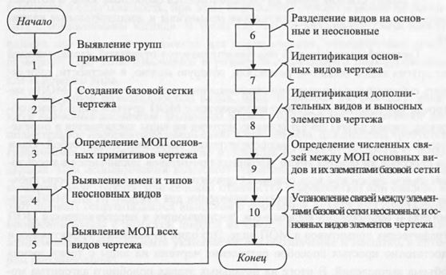

Автоматическое определние видов чертежа должн обеспечить определение основных и дополнительных видов. Предлагаемый алгоритм автомтического определния видов чертежей основывается на следующих основных положениях:
* Взимное расположение всех основных видов чертежа строго определяется стандартом, а дополнительные, местные виды и выноски сопровождаются соответствующими именами (надписями);
* область на поле чертежа, занимаемая каждым видом, определяется положением только связанных друг с другом основных графичских примитивов (отрезков, полилиний, луг и окружностй), которые в совокупности составляют графическое изображение вида. При этом не должны учитываться вспомогательные примитивы, относящиеся к виду, – осевые линии, линии штриховки сечений и разрезов, размерные и технологические обозначения;
* каждый дополнительный, местный вид и вносной элемент сопровождаются именами. Для них характерно отсутсвие проекционных связей с основными видами, но эта связь, однако, может быть выявлена через их имена;
* между каждым видом на чертеже имеются свободные зоны, в которых могут располагаться вспомогательные примитвы и дополнительные надписи.

Алгоритм определения видов конструкторских чертежей (см. рисунок) встраивается в первый этап общего алгоритма МАС-параметризации и может быть условно разделен на 4 этапа. На первом (подготовительном) этапе в блоке 1 осуществляется чтение файла описания чертежа, анализ графических элементов, входящих в чертеж, и разделение их на отдельные
группы, исходя из их типов (основные - отрезки, дуги, окружности, полилинии; вспомогательные - оси симметрии и заголовки видов; ассоциативные- размерные и технологические обозначения, штриховка и т. д.). Одновременно с анализом геометрических параметров графических элементов в блоке 2 создаются базовые сетки (прямоугольные по осям X и Y и угловая
АН), определяются МОП основных примитивов чертежа (блок 3) и выявляются имена и типы всех неосновных видов и точки их привязки (блок 4).

На втором этапе выявляются МОП всех видов чертежа склеиванием МОП основных примитивов чертежа (блок J). Далее осуществляется разбиение этих видов на основные и неосновные (блок 6). Основные виды выявляются по наличию между ними проекционной связи и относительно точного равенства высоты и ширины их МОП между собой. Неосновные виды явной проекционной связью не обладают, но зато они могут быть легко связаны с их именами и типами, выявленными на этапе 1. На этом этапе также определяется количество основных видов чертежа. Заканчивается этап идентификацией основных видов чертежа (блок 7). Идентификация видов базируется на анализе предварительно отсортированных по координатам Х и Y центров масс МОП основных блоков, т. е. их взаимном расположении и общем количестве, которое не должно превышать шести. Следует отметить, что идентификация основных видов может быть несколько осложнена двумя обстоятельствами. Первое связано с тем, что при неправильном склеивании МОП основных примитивов возможно объединение в один МОП двух МОП, один из которых относится к дополнительному виду, а другой - к основному. Этого можно избежать, если подклеивание осуществлять к МОП вида только при наличии непосредственной связи текущего примитива МОП с примитивом, ранее уже включенным в рассматриваемый МОП вида. Второе усложнение связано с использованием ломаного сечения или с дополнительным видом, который изображается довернутым. В таких случаях габариты этого вида могут не соответствовать другим проекционным видам. Такая ситуация должна отслеживаться по наличию обозначения ломаного сечения или при дополнении имени вида условным графическим обозначением поворота О.

При идентификации видов прежде всего выявляется положение главного вида. Если основной вид один, то он и является главным.
При наличии двух основных видов, расположенных вертикально или горизонтально, а также при наличии трех горизонтально расположенных видов (равенства координат Y соответствующих им МОП) главным из них признается тот, с которым связано большее число размерных обозначений и линий симметрии. При наличии трех основных видов и равенстве координат X центров масс их МОП (вертикальное расположение видов) считается, что к главному виду относится средний. В случае четырех МОП, расположенных только горизонтально (координаты Y центров масс у всех МОП одинаковые), к главному виду относится второй слева.

Определив положение главного вида, легко определяются имена остальных основных видов чертежа, исходя из требований ЕСКД.
После идентификации основных видов осуществляется идентификация дополнительных видов и выносных элементов (блок 8) в соответствии с ЕСКД на основе сопровождающих их имен, стрелок и выносок. На третьем этапе (блок 9) определяются численные связи между всеми МОП основных видов по расстояниям между ними. Также устанавливается полное взаимное соответствие между элементами базовых сеток, относящихся к разным основным видам - для видов слева и справа по сетке X устанавливается
двухсторонняя связь с сеткой Y для видов снизу и сверху. Кроме того, такая же взаимная связь устанавливается для элементов части сетки X, относящейся к виду сзади, с одной стороны, и видам снизу, главным и сверху по координатам X — с другой.

На последнем этапе (блок 10) алгоритма устанавливается взаимное соответствие между элементами базовой сетки по координате X и Y, которые относятся к соответствующим неосновным видам, и элементами базовой сетки, относящимся к основным видам.
