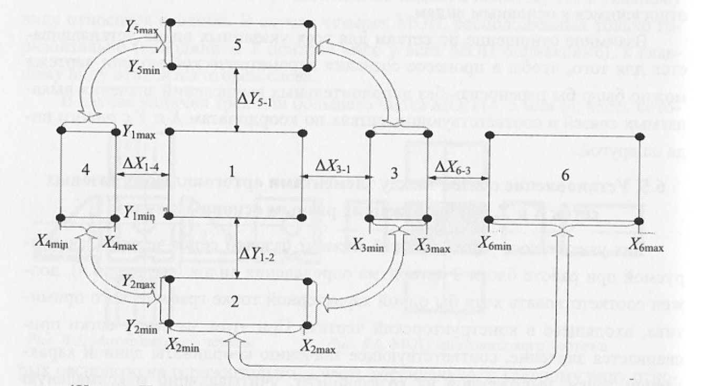
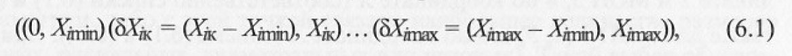
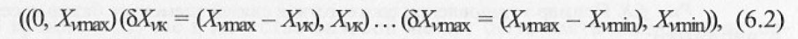
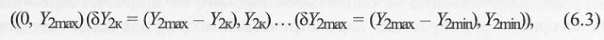
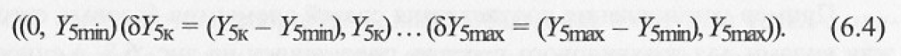
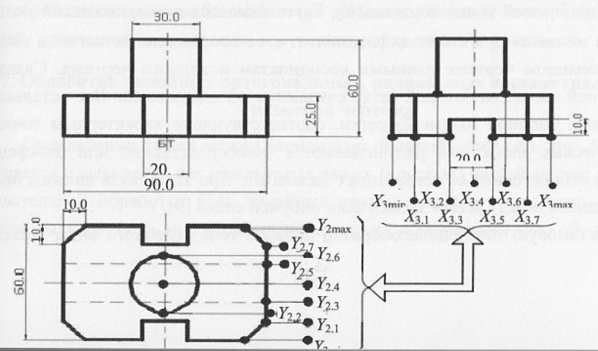
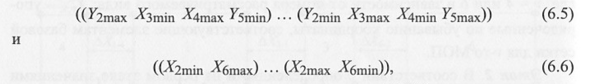

# Вопрос 29: Алгоритм установление связей между элементами ортогональных базовых сеток X и Y, принадлежащих разным основным видам чертежа.

Алгоритм включает следующие этапы:

**Этап 1.** Для видов 1, 3, 4 и 6 (рисунок 1) выявляются минимальные и максимальные значения координаты Х минимально охватывающего прямоугольника (X_imin и X_imax), а для видов 2 и 5 - минимальные и максимальные значения координаты Y (Y_jmin и Y_jmax). Также определяются соответствующие расстояния между основными видами (между прямоугольниками, соответствующими этим видам) - ΔX_1-4, ΔX_3-1, ΔX_6-3, ΔX_1-2, ΔX_1-5. 
В соответствии с определенными на первом этапе значениями X_imin и X_imax для видов 1 (2, 5), 3, 4 и 6 выявить все элементы базовой сетки Х, попадающие в указанные диапазоны. Затем для каждого вида составляются списки или массивы пар, состоящих из упорядоченных значений каждого базового элемента и расстояния в миллиметрах этого элемента от соответствующего левого края МОП для видов 1 (2,5) и 3 и от правого края видов 4 и 6.
Например, списки МОП 1 ***1 (2,5 ) и 3*** представляются в виде

где i=***1 (2, 5) или 3*** в зависимости от номера рассматриваемого вида: X_ik - упорядоченные по возрастанию координаты, соответствующие элементам базовой сетки i-го МОП, а для МОП 4 и МОП 6 в виде

где ν = 4 или 6 в зависимости от номера рассматриваемого вида; Х_ν,k - упорядоченные по убыванию координаты, соответствующие элементам базовой сетки ν-го МОП.

**Этап 2.** В соответствии с определенными на первом этапе значениями Y_jmin и Y_jmax для видов 2 и 5 выявляются все элементы базовой сетки Y, попадающие в указанные диапазоны. Затем для каждого вида составляются списки или массивы пар, состоящих из значений для каждого базового элемента и расстояния в миллиметрах этого элемента от соответствующего верхнего края вида 2 и нижнего края вида 5 соответствующих МОП. Так для МОП 2 список представляется в виде

где Y_2k - упорядоченные по возрастанию координаты, соответствующие элементам базовой сетки, которые принадлежат МОП 2, а для МОП 5 в виде

где Y_5k - упорядоченные по возрастанию координаты, соответствующие элементам базовой сетки, которые принадлежат МОП 5.

**Этап 3.**

Осуществляется последовательный анализ всех пар элементов в списках (6.3) и (6.4), составленных на втором этапе для МОП 2 и 5 по координате Y и МОП 3, 4 по координате Х (соответственно (6.1) и (6.2)), а также для МОП 1 (2, 5) и 6 по координате Х (списки (6.1) и (6.2)). При совпадении в рассматриваемых парах первых элементов (значений расстояния элемента базовой сетки от края соответствующего МОП) формируются списки соответствия базовых элементов, принадлежащих сеткам по координатам Х и Y, например: 

и из соответствующих списков пар анализируемых МОП исключают те паре, для которых найдены соответствия. Те паре, для которых не найдено не одного соответствия, также удаляются из соответствующего списка МОП.
Этап 3 продолжается до тех пор, пока не будут вычищены все списки для МОП. На этом алгоритм установления соответствия между элементами базовых элементов сеток завершается.
