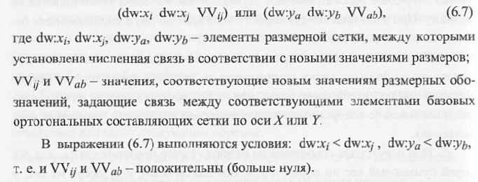
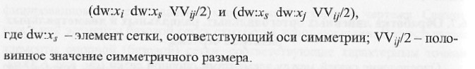

# Вопрос 31: Алгоритмы обработки одиночных линейных ортогональных, радиальных и диаметральных размеров чертежа для пополнения связей между элементами базовой сетки.

Определение связей между элементами опорной сетки начинается с выявления так называемых явных (простых) связей за счет последовательной обработки всех линейных вертикальных н горизонтальных, а также радиальных и диаметральных размерных обозначений. Это обусловлено тем, что подобные размерные обозначения непосредственно устанавливают связи между элементами соответствующих составляющих сетки, связанных с этими размерами.

1. Последовательно просматриваются все линейные горизонтальные и вертикальные размеры, выявляются их значения и точки привязки к элементам изображения и определяются соответствующие им элементы размерных сеток DW:X и DW:Y no координате Х (для горизонтальных размеров) и Y (для вертикальных размеров). Элементы этих сеток, по сути, являются копией базовых сеток по координатам Х и Y.

2. Создаются отдельные составные списки (или массивы) связей по координатам Х и Y, куда попарно заносятся те элементы сетки, для которых установлена связь после обработки каждого линейного несимметричного размерного обозначения. Элементы этих списков связей представляются записями:

3. Если обрабатываемый размер симметричный, то после его обработки в список связей заносится две записи по соответствующей координате. Haпример, по координате Х:

4. Последовательно просматриваются все радиальные и диаметральные размерные обозначения, и для каждого размера выявляется окружность или дуга, на которой этот размер установлен.

4.1. Если выявлена окружность, то в список связи для создаваемой модели чертежа заносятся 4 записи, связывающие центр окружности со всеми квадратными точками чертежа через значение нового радиуса R или половинное значение диаметра D/2. Например:

4.2. Если выявлена дуга, то списки пополняются от одной до четырех записей по координате Х (Y) B зависимости от количества квадрантных точек, входящих в зону дуги в соответствии с выражениями (6.8) и (6.9).

5. B описании чертежа последовательно находят все окружности и дуги радиуса или диаметра, равного по значению размеру выявленной в п. 4 дуги или окружности, и для каждой из них в списки добавляются записи в соответствии с подп. 4.1 или 4.2.

6. Каждый элемент сетки, для которого в пп. 1-5 установлена связь в одном виде, проверяется на соответствие опорной сетке с элементами на других видах. Это делается по спискам межвидовых связей. Иными словами, если такая связь установлена по одной координате, то в параметрическую модель следует добавить соответствующие записи по другой координате для связанного вида.

7. Корректируется список контроля полноты создаваемой параметрической модели чертежа. Список состоит из двух подсписков элементов вспомогательной базовой опорной сетки (размерной сетки) DW:X и DW:Y, в которые, прежде всего, заносятся элементы сетки, связанные с базовой точкой чертежа. Далее подсписки пополняются при формировании параметрической модели за счет элементов, с которыми устанавливается связь B процессе обработки размерных обозначений. Процесс продолжается до полного охвата всех элементов базовой сетки.

