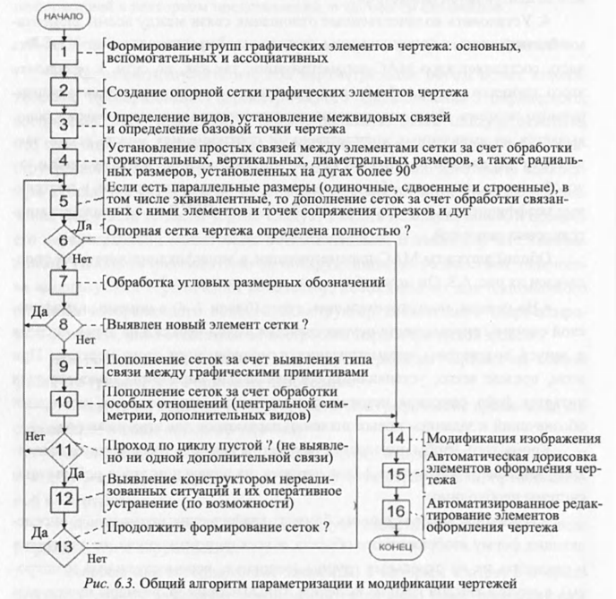

# Вопрос 32. Особенности алгоритма пополнения связей между элементами базовой сетки при обработки отдельных параллельных размеров, установленных на отрезки.

Обработка вертикальных и горизонтальных размеров для формирования размерной сетки чертежа и установления связей между соответствующими элементами базовой сетки по координатам X и Y осуществляется на первом этапе общего алгоритма МАС-параметризации (пример на рисунке ниже) и не представляет сложности из-за простоты и очевидности данного процесса. Поскольку такие размерные обозначения непосредственно (явно) связаны с соответствующими элементами базовой сетки чертежа, нет смысла останавливаться на этом процессе более подробно.

Более интересен дальнейший процесс формирования размерной сетки, который связан с обработкой линейных параллельных (наклонных) и угловых размерных обозначений. Для решения задачи обработки параллельных размерных обозначений все имеющиеся в текущем чертеже параллельные размеры в соответствии с возможными способами их алгоритмической обработки [27] целесообразно разбить на 4 группы:

-	одиночные размеры, устанавливаемые на отдельные наклонные отрезки;
-	попарно связанные размеры, устанавливаемые на 2 отрезка, имеющих общую точку;
-	связанные в тройки, в которые входят размеры, установленные на 3 связанных друг с другом отрезка, в совокупности образующие треугольники;
-	особые случаи, куда следует отнести размеры, поставленные на отрезки, на конце (концах) которых находятся одна или две дуги сопряжения.

> Страница 129-130 методички
