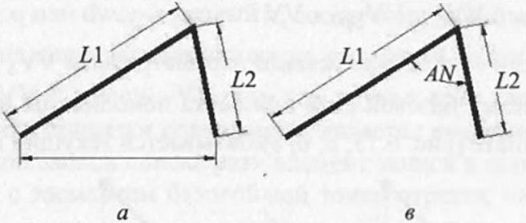

# Вопрос 34: Алгоритмы обработки попарно связанных параллельных размеров свободные концы отрезков, на которых они установлены, находятся на одном уровне.

Связанные в пары параллельные размеры представляют более сложную конструкцию для определения численных или функциональных
связей размерной сетки, так как в этих случаях необходимо одновременно устанавливать связь для общей точки двух отрезков
сразу по обеим координатам.

Если свободные концы связанных параллельных размеров находятся на одной координате (а, в), то определять параметры
связи необходимо только для общей точки обоих размеров. Процесс определения значений таких связей достаточно очевиден и не
представляет особой трудности в плане вычисления. Он основывается на решении уравнения, составленного из условия равенства
катетов для двух прямоугольников, образованных перпендикуляром, опущенным из общей точки на линию, соединяющую свободные
концы отрезков, расстояние между которыми должно быть известно благодаря явному или неявному заданию. Для случая (в), это
растояние находится по теореме косинусов.