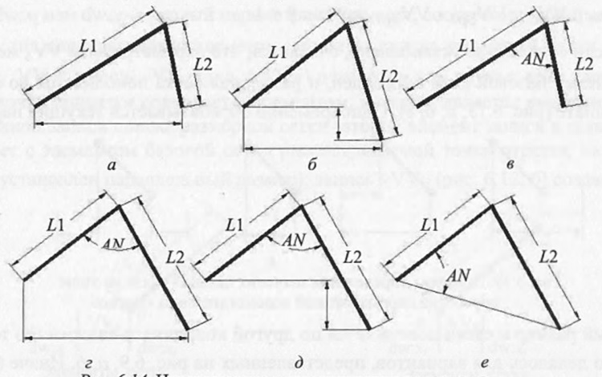

# Вопрос 35: Алгоритмы обработки попарно связанных параллельных размеров свободные концы отрезков, на которых они установлены, находятся на разном уровне.

Связанные в пары параллельные размеры представляют более сложную конструкцию для определения численных или функциональных
связей размерной сетки, так как в этих случаях необходимо одновременно устанавливать связь для общей точки двух отрезков
сразу по обеим координатам.

	
Сложность выявления связей для общей точки двух отрезков и соответствующих ей элементов базовой сетки несколько возрастает
в случае, когда свободные концы отрезков не лежат на одном уровне (значения их координаты по оси X или Y отличаются), как
это представлено на (б, г, д, е). В подобных вариантах необходимо вначале определять расстояние между свободными
концами связанных отрезков, исходя из известных для них значений координат, а далее находить связи для общей точки с другими
точками этих треугольников по координате $$ X(Dx_{ij}) $$ и координате $$ Y(Dy_{ik}) $$ так, как будто бы их концы находятся на одном уровне (а, в). Затем, исходя из наклона линии связи свободных концов к соответствующей оси координат (например, на угол
Alf к оси абсцисс), следует определять реальные значения связи общей точки с другими точками треугольника развернув
треугольник вокруг общей точки на соответствующий угол. Реальные значения $$ Dx^*_{ij} $$ и $$ Dy^*_{ik} $$ находятся умножением
значений $$ Dx_{ij} $$ и $$ Dy_{ik} $$ на матрицу поворота на угол Alf.

После определения реальных значений связи по каждой координате пополняются подсписки DW:X и DW:Y размерной сетки параметрической
модели по обеим координатам.

Сложность выявления связей для размерных и опорных сеток возрастает в случаях, когда для двух связанных отрезков (параллельных
размеров) известен не угол, лежащий между ними, а угол наклона одного из этих отрезков (е). Здесь вначале для нахождения
расстояния между свободными концами приходится использовать теорему косинусов. Далее этот вариант сводится к рассмотренным ранее.

При неявном задании свободных концов двух связанных параллельных размеров (отрезков) очевидно, что задача определения
параметрических связей соответственно усложняется. Для этого необходимо вначале разрешить неопределенность задания свободных
концов как описывалось ранее ([Вопрос 33](tickets/23.md)). Только после этого можно приступать к решению основной задачи -
нахождению связи для общей точки этих отрезков (размеров).