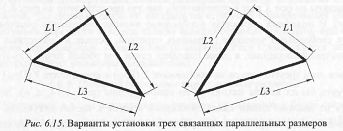
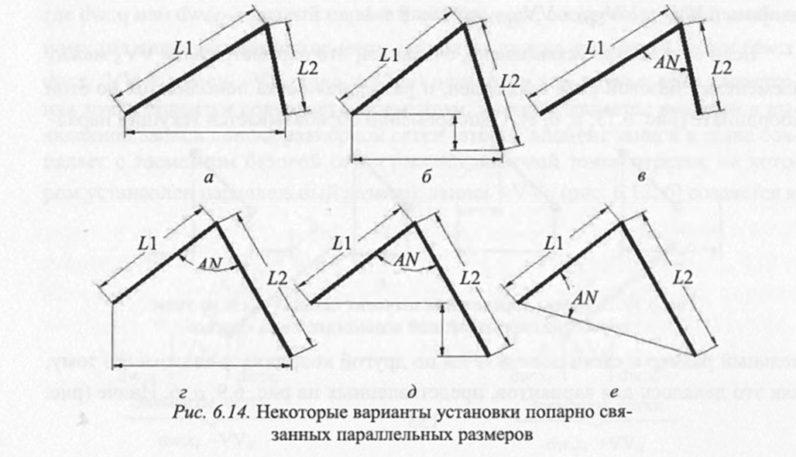

# Вопрос 36. Алгоритм обработки параллельных размеров, связанные в тройки

Параллельные размеры, установленные на 3 связанных друг с другом отрезка, в совокупности образуют треугольники (рис. 6.15). Этот случай должен рассматриваться тогда, когда программа не смогла выявить явную или опосредованную (неявную) связь в размерной сетке между свободными концами двух связанных параллельных размеров.

Особенность данного варианта заключается в том, что вершины образо­ванного этими отрезками и параллельными размерами треугольника могут быть как связаны с уже установленной размерной сеткой других графических примитивов чертежа, так и не связаны с ней.

В первом случае ориентация такого треугольника должна определяться этими связями, а во втором она может быть произвольной. Однако и в пер­вом, и во втором случаях задача определения значения параметров связи (по­полнения ортогональной размерной сетки по обеим координатам) может быть сведена к двум этапам:
- определению связей подобно варианту, представленному на рис. 6.14, в;
- коррекции значений параметров связи с учетом разворота треугольни­ ка в системе координат до требуемого положения на определенный угол во­круг одной из его вершин. Величина угла должна определяться либо усло­виями привязки треугольника к опорной сетке остальных графических эле­ментов чертежа, либо, если таких условий не выявлено, она может определяться исходным наклоном одного из отрезков (размеров) к осям координат.

