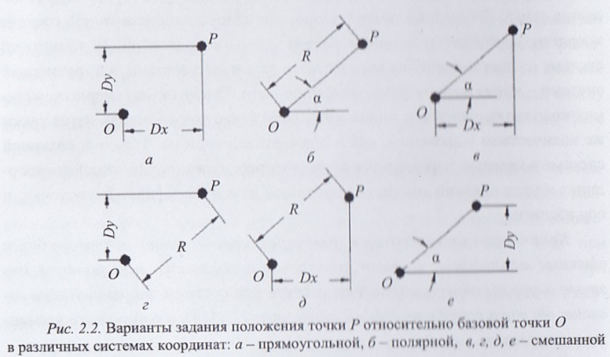

# Вопрос 46: Понятие “параметризация геометрических объектов”. Параметризация базовых геометрических примитивов. Параметры формы и параметры положения.

## Понятие “параметризация геометрических объектов”

***Параметры*** - независимые величины, предназначенные для выделения элемента или подмножества элементов из данного множества. В геометрических задачах и в конструкторских чертежах параметры выделяют единственную фигуру или подмножество фигур из множества геометрических фигур, соотв. одному и тому же семейству (определению). Параметры отображаются с помощью 4-х типов размерных обозначений - **линейных**, **радиальных**, **диаметральных** и **угловых**.

***Количество независимых параметров***, определяющих примитив, зависит только от размерности используемой для этого системы описания и не зависит от типа координатной системы, в которой эти элементы описываются.

### Необходимость параметризации
- определения минимального количества размерных обозначений для однозначного описания изделия при его конструировании.
- контроля достаточности и независимости размерных обозначений, используемых в чертеже, для обозначения описания формы изображаемого объекта.
- создание параметрических моделей эскизов и объемных тел в параметрических системах, на базе которых происходит автоматическая модификация.

***Параметризация геометрических объектов*** - процесс определения совокупности независимых параметров и их необходимого и достаточного количества для полного (однозначного) описания геометрической фигуры, состоящей из множества графических примитивов.

***Процесс создания параметрической модели описания геометрического объекта или фигуры*** - процесс формирования количественных зависимостей для всех составляющих графических примитивов фигуры в функции (в зависимости) от параметров, используемых в описании этого объекта, с учетом взаимных отношений между примитивами.

Процесс параметризации произвольных геом. объектов основывается на параметризации отдельных графических примитивов, составляющих изображение.

## Параметризация базовых геометрических примитивов. Параметры формы и параметры положения.

### Точка

Положение точки определяется параметрами:
- на линии одной одной координатой
- в декартевой СК двумя координатами
- в трехмерной системе тремя
- в полярной расстояние от начала координат и угол

Общее количество вариантов заданий точки C(n = 4, k = 2) = 6 (Количество сочетаний из n по k)

Другие графические примитивы задаются как совокупное задание их характерных точек. Количество вариантов заданий сложнх графических объектов >> количество заданий точки.

### Отрезок

Требуется начальная и конечная точка => 2 \* С(4,2) \* С(4,2)= 72. Каждая точка может быть задана относительно начала СК и относительно другой точки, поэтому коэф. 2.

### Окружность

Задание координат точки центра и задание радиуса.

### Произвольная дуга окружности

Определяется тремя точками, центром окружности, образующей дугу, точки начала и конца дуги, они формируются против часовой стрелки относительно точки начала.

По 2 параметра на точку центра и начальную точку и один параметр для конечной точки. Того 5 независимых параметров.

### Эллипс

В общем случае 5 параметров (координаты центра, длины двух полуосей и угл наклона его главной оси к оси координат)

### Дуга элипса

На 2 параметра больше чем у элипса.

### Сплайн

Для полного сплайна из n точек, требуется 2n для двумерной системы, для трехмерной 3n, которые определяют положение этих точек, и k доплнительных параметров или ограничений, определяемых типом формируемого сплайна (кубический, параболический, Безье, В-сплайн, ...)

