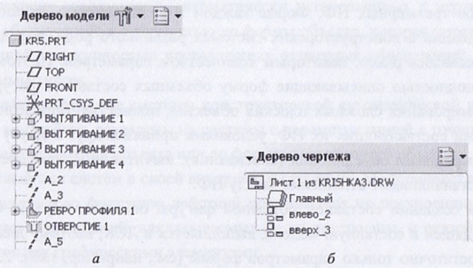

# Вопрос 47: Параметризация сложных объектов. Глобальная и локальные системы координат. Определение параметров и их количества для сложных объектов.

Составные объемные фигуры являются результатом объединения в единое
целое трехмерных НФ. Форма каждой НФ, независимо от способа ее
формирования в конструкторских системах различного рода, определяется,
как указывалось ранее, некоторым количеством параметров. Поэтому параметры,
полностью описывающие форму объемных составных фигур, как и
при формировании сложных плоских объектов, полностью определяется параметрами
составляющих их НФ, условиями привязки друг к другу и булевыми
операциями объединения (склеивания), вычитания и пересечения, которые
устанавливают отношения между НФ.

При создании составной объемной фигуры описание первой, базовой,
НФ (непроизвольной фигуры), входящей в составную модель, выполняется в ЛСК (локальной системе координат), поэтому для ее описания
достаточно только параметров формы. Следующие
НФ, входящие в составную фигуру, должны описываться в ГСК (глобальной системе координат).
Однако количество необходимых параметров для их однозначного описания
гакже сокращается. Это сокращение достигается за счет учета условий привязки
(ограничений), которые накладывают ранее построенные НФ (первая
или последующие) на очередную НФ, добавляемую в составную фигуру, усложняя
ее структуру.

Объединение (склеивание) непроизводных фигур приводит к появлению
составной фигуры, в которой эти НФ имеют общую область соприкосновения
(склеивания) ненулевой площади. Параметры новой фигуры определяются
простой суммой параметров составляющих ее НФ с учетом уменьшения
их общего количества за счет ограничений, определяемых параметрами формы
и положением области их склеивания.

Операции вычитания и пересечения формируют составную фигуру новой
формы, которая принадлежит обеим независимым формам, участвующим
н этих операциях. При этом параметры составной фигуры также определяются
суммой параметров исходных НФ с учетом уменьшения их количества за
счет накладываемых взаимных ограничений и привязок.
Для удобства представления структуры сложных объемных фигур и соответствующих им чертежей в современных САПР используются механизмы,
называемые Деревом модели к Деревом чертежа (см. рисунок).
Эти механизмы позволяют наглядно отобразить элементы, из которых состоит
созданная фигура (чертеж), и обеспечивают эффективный доступ к параметрам
этих элементов для их оперативного изменения и редактирования.
При этом для каждого элемента дерева формируется соответствующая
внутренняя структура параметрического описания сечения и/или

трехмерной НФ, которая позволяет эффективно перестраивать этот элемент.

Параллельно с формированием объектов во внутреннюю структуру данных
заносится информация по каждой характерной точке формируемого
элемента, связям (ребрам) между точками и граням объемного примитива.
Информация по каждой грани содержит данные о принадлежащих ей точках,
ребрах, цвете и фактуре, а также о значении внешней нормали к этой грани.
Все эти данные позволяют оперативно обеспечить различный стиль показа
объекта (в каркасном представлении, когда видны все ребра, - со скрытыми
линиями, без скрытых (невидимых) линий и в твердотельном виде). Соответствующие
графические представления позволяют обеспечить интерактивную
привязку к требуемой структуре данных на любом этапе формирования модели.
Внутренняя структура данных модели является единой для всех типов
формируемых в системе объектов (деталей, чертежей, сборок, производства и
т. д.), и поэтому внесение изменений в один тип отражается и в других типах.