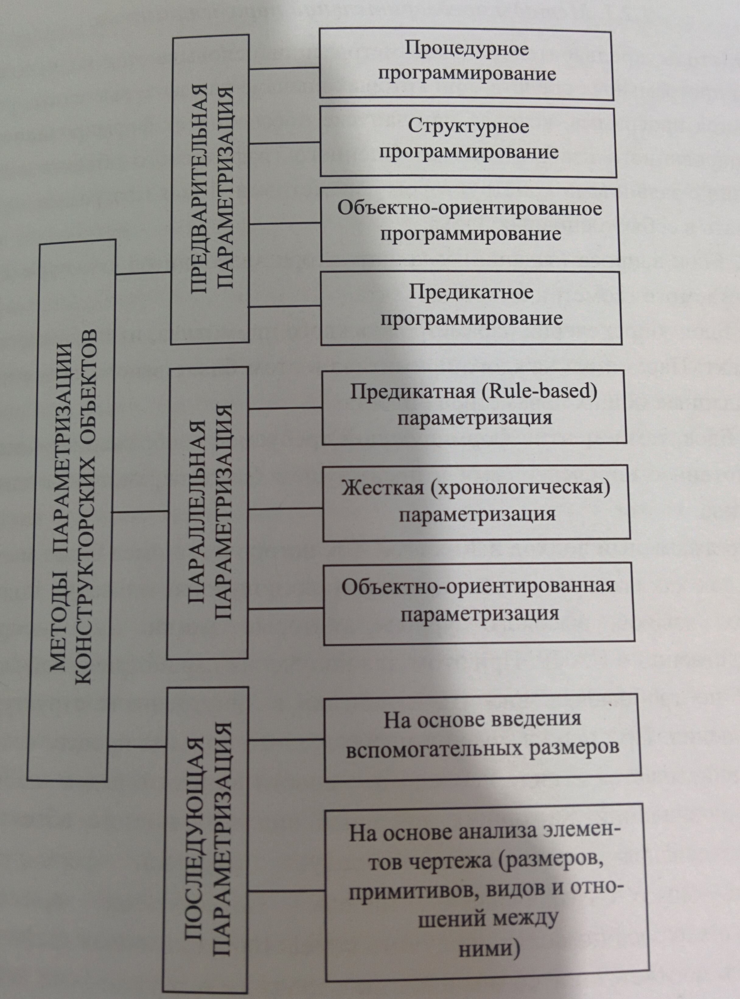

# Вопрос 50. Программная параметризация и основные направления ее использования. Особенности создания программных средств формирования конструкторских элементов. Общий алгоритм формирования программных параметрических моделей.

---
**Примечание:**  
_Информация по данному вопросу была полностью взята из [Вопроса 3](3.md).
Программная параметризация - это то же самое, что и предварительная параметризация._

---

При разработке моделей представления геометрических объектов САПР возникла потребность в механизме, позволяющем автоматически модифицировать форму созданной модели, изменяя значения задающих параметров.

Данная проблема была решена на основании методов создания параметрических моеделей геометрических объектов, в основу построения которых был положен процесс их аавтоматической параметризации. При этом процесс создания параметрической модели представляет собой формирование количественных для каждого из всех составляющих её элементов с учётом их взаимного положения и отношений в виде функций от независимых параметров, которые определяют форму объекта или фигуры. В соответствие с теорией параметризации понимается процесс определения совокупности независимых параметров и их необходимого количества для полного определения формы объекта или фигуры в целом. В то же время параметрическая модель геометрического объекта определяет через эти общие параметры значения параметров каждого конкретного графического примитива.

Таким образом, в системах параметрического моделирования графические примитивы, составляющие в совокупности конструкторские объекты, сохраняют информацию о своих собственных параметрах в функции от базовых параметров объектов в целом и могут быть модифицированы практически в любой момент за счёт изменения значений этих базовых параметров.

Методы предварительной параметризации.

Основаны на использовании программных средств, при которых сначала на языке высокого уровня создаётся программа, которая при запуске обеспечивает формирование модифицированного изображения обощённого графического объекта в соответствии с заданным конструктором параметрами. Такая программа должна включать в себя три основных блока:

1. Блок запроса (задания) у конструктора значений общих параметров изображаемого графического объекта.
2. Блок определения параметров каждого примитива, из которых состоит объект. Параметры каждого примитива в этом блоке вычисляются на основе заданных общих параметров объекта.
3. Блок, поэлементно формирующий требуемое изображение объекта в соответствии с определёнными в предыдущем блоке параметрами каждого примитива.

При использовании программного подхода описание модели на языке высокого уровня позволяло встроить её в САПР, при этом не требовалось вносить изменения во внутреннюю структуру САПР. Создание детали записывается в виде последовательности команд с рядом ключевых параметров-значений, задающих конечный вид создаваемого объекта.

Программный подход имеет несколько направлений – процедурное, структурное, объектно-ориентированное, предикатное программирование.

На начальном этапе создания моделей конструкторских объектов программы рассматривались как последовательность процедур, выполняющих определённые действия над данными. Процедуры и функции представляют собой набор команд, выполняемых в определённом порядке под управлением головной программы, и отличаются друг от друга описанием заголовков и способами передачи данных и возвращения вычисленных в них значений параметров. Данные были отделены от процедур.

Основная идея структурного программирования соответствует принципу максимального разделения общей относительно сложной для простого описания задачи на группу нескольких мелких составных задач. Указанное деление необходимо совершать до тех пор, пока задачи не станут максимально простыми для понимания и программирования. Недостатки. Первый. Не реализовано естественное желание воспринимать данные и действия над ними как единое целое. Полностью отсутствуют встроенные способы связи данных с функциями. Программисты заново изобретали решения, оказывавшись не в состоянии использовать стандартные решения.

Объектно-ориентированное программрование предоставляет технологию управления элементами любой сложности, создавая условия для многократного использования прогаммных компонентов и объединения данных с методами их обработки. Суть заключается в использовании концепции "объектов".

Основой для построения языка предикатного программирования P является множество всевозможных логически правильных конструкций, допустимых в предикатных программах, которые определяются множеством вычислимых логических композиций, порождаемым исчислением вычислимых предикатов. По набору языковых конструкций язык P значительно шире известных языков функционального программирования. Предикатная программа есть набор рекурсивных определений предикатов, среди которых могут находиться описания типов и глобальных переменных. При этом базисом исчисления предикатного программирования являются композиции следующего вида: суперпозиция (block), альтерация (if), параллельная композиция, применение предиката, порождение предиката, конструктор массива. Конструкция считается логически правильной, если соответствующая ей композиция является логической. Язык программирования является предикатным, если все его исполняемые конструкции логически правильные.

Предикатная программа является правильным логическим объектом. Поэтому с ней можно работать в традиционном математическом стиле.

Программный подход к параметризации подразумевает некую интерактивность работы, сводящуюся к вводу значений определяющих форму объекта параметров из заданного диапазона. Повысить функциональность данного вида моделей можно, введя в состав запрашиваемых параметров модели не только числовые значения, но и простейшие условные выражения.

Основные недостатки программного подхода – ограниченное число определяющих параметров исходной модели из-за возрастающей сложности написания макроса, предопределённость их диапазона, а также недостаточность средств контроля корректности получаемого результата, который может оказаться семантически ошибочным. Эта модель оперативно не редактируется. Модель необходимо откатывать и пересоздавать.

В настоящее время программный подход используется только для решения ограниченного числа задач (макросы).

В конструкторских САПР программный подход сейчас широко применяется для формирования элементов оформления чертежей - размерных и технологических обозначений, создания стандартных конструкторских элементов: стрелки, полочки, выноски и т.д.

В архитектурных программные модели используются для построения стен, окон, дверей и т.д.
