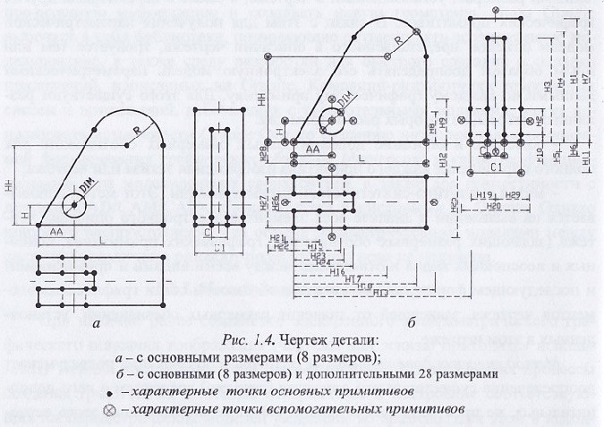

# Вопрос 52: Последующая параметризация, ее особенности, достоинства и недостатки. Методы формирования параметрических моделей графических описаний объектов при последующей параметризации.

---
**Примечание:**  
_Информация по данному вопросу была полностью взята из [Вопроса 5.](5.md)_

---

При разработке моделей представления геометрических объектов САПР возникла потребность в механизме, позволяющем автоматически модифицировать форму созданной модели, изменяя значения задающих параметров.

Данная проблема была решена на основании методов создания параметрических моделей геометрических объектов, в основу построения которых был положен процесс их автоматической параметризации. При этом процесс создания параметрической модели представляет собой формирование количественных для каждого из всех составляющих её элементов с учётом их взаимного положения и отношений в виде функций от независимых параметров, которые определяют форму объекта или фигуры. В соответствие с теорией параметризации понимается процесс определения совокупности независимых параметров и их необходимого количества для полного определения формы объекта или фигуры в целом. В то же время параметрическая модель геометрического объекта определяет через эти общие параметры значения параметров каждого конкретного графического примитива.

Таким образом, в системах параметрического моделирования графические примитивы, составляющие в совокупности конструкторские объекты, сохраняют информацию о своих собственных параметрах в функции от базовых параметров объектов в целом и могут быть модифицированы практически в любой момент за счёт изменения значений этих базовых параметров.

Интерактивный подход создания параметрических моделей графических изображений - подход, при котором параметрическая модель создается специализированной автоматизированной системой.  

Интерактивный подход предполагает не только использование средств автоматической параметризации формируемых графических примитивов и образов, но и наличие встроенного в систему САПР механизма преобразования графического описания в параметрическую модель объекта.  

Одним из методов реализации интерактивного подхода является **последующая параметризация**.  

При наличии ранее созданного электронного непараметрического графического описания изображения (чертежа или эскиза) приходится использовать методы последующей параметризации. В этих случаях процессы создания графических описаний изображений и построение соответствующих им параметрических моделей разделены во времени. При этом в исходном графическом файле описания изображения или чертежа детали в явном виде представлены только данные о графических примитивах, составляющих изображение. Здесь нет явной информации о способах и последовательности их формирования (алгоритме их формирования) и взаимных связях между примитивами. Хотя файл и содержит описание параметризованного эскиза или чертежа, в котором присутствует необходимое и достаточное количество размерных обозначений для описания формы объекта в целом, эти размерные обозначения непосредственно не связаны с каждым графическим примитивом, входящим в графическое описание объекта. Количество этих размерных обозначений (параметров) значительно меньше, чем необходимо при непосредственном выполнении автоматической модификации и перерисовке каждого графического примитива чертежа с помощью средств ЭВМ.

Иными словами, корректно сформированное описание детали, представ-
ленное в виде конструкторского чертежа, является, по сути, графическим параметрическим описанием только с точки зрения человека. Однако такое описание не является параметрическим для ЭВМ, так как в нем нет явной связи параметров каждого входящего в него графического примитива со значениями размеров, установленных в чертеже, а также с параметрами других графических примитивов. В связи с этим для получения параметрической модели объекта, представленного в описании чертежа, требуется тем или иным образом доопределять его электронную модель параметрическими данными по каждому графическому примитиву. Для этого существуют различные методы, из которых рассмотрим два.

_Метод внесения дополнительных размерных обозначений_ подразумевает доопределение существующего описания (чертежа) введением в него дополнительных, не проставляемых в дальнейшем при модификации этого чертежа, размерных обозначений, которые функционально зависят от основных (задающих)‚ имеющихся в чертеже, размеров и особенностей связи между графическими примитивами. Методология этого подхода относительно проста, так как требует только выявления необходимых дополнительных размерных обозначений, вычисления их значений и ввода их в чертеж. Эти размеры добавляют в файл базового изображения (или дорисовывают в чертеж) так, чтобы охватить размерной сетью все характерные точки всех графических примитивов. Таким образом, создается параметрическая модель, все графические примитивы которой оказываются зависимыми от задающих параметров (рис. 1.4, a, 6). При этом осуществляется относительно несложная программная доработка обычных систем формирования конструкторских чертежей, а дополняет размерами изображение детали или чертежа (добавляет и исходный чертеж дополнительные размеры, функционально зависящие от задающих размеров) непосредственно конструктор. Однако реализация метода затруднена:

- ввиду сложности, в ряде случаев, функционального определения и вычисления значений дополнительно вводимых размерных обозначений в зависимости от управляющих (первоначально установленных) размеров чертежа (например, см. H4 и Н24 на рис. 1.4, б);

- ввиду большого количества дополнительных размеров, число которых часто превосходит число основных задающих размеров во много раз (см., например, рис. 1.4, б).

Это существенно усложняет как само базовое изображение (параметрическую модель), так и работу конструктора по его созданию. В связи с этим такой метод использовался только на начальных стадиях развития систем последующей параметризации и в настоящее время полностью исключен из практики параметризации.

_Метод аналитико-синтетической параметризации чертежа_ базируется на автоматическом анализе задающих размерных обозначений, графических примитивов и видов, используемых в чертежах, а также их взаимного расположения и связей между ними. Метод основывается на том, что чертеж сам по себе является параметризованным изображением в котором форма изображения полностью и однозначно определяется имеющимися в описании размерными обозначениями, a условия отношений между всеми изображенными объектами отражены и закреплены в графическом виде. Метод при реализации использует принцип решения нелинейных уравнений, которые описывают систему связей, управляющих формой объектов, составляющих чертеж.

Данный метод параметризации (создания параметрической монета) позволяет конструктору работать, не задумываясь о порядке, в котором определены или учтены связи, a также об их достаточности для полного описания геометрии конструкции. Такой подход позволяет решать проблему, следуя по наиболее естественному пути, обеспечивая процесс автоматического преобразования графического параметрического представления в электронную параметрическую модель, которая может быть использована ЭВМ в дальнейшем для преобразования (модификации) изображения.

Ключевое преимущество использования технологии параметризации посредством анализа элементов чертежа, т. е. анализа графической модели объекта, представленного в виде его чертежа в электронном описании, - возможность автоматического (без участия конструктора) определения всех геометрических характеристик всех примитивов этого чертежа через используемые в нем размеры. Такие автоматически создаваемые параметрические модели позволяют эффективно строить чертежи модифицированных объектов. Таким образом. поиск нужного решения осуществляется в десятки раз быстрее, так как конструктору нет необходимости самостоятельно выявлять неизвестные факторы посредством определения тина связей между графическими примитивами исходного чертежа и вводить в него множество дополнительных размеров.

С точки зрения практической реализации параметризации на основе анализа всех элементов электронного описания чертежа представляет собой метод обеспечивающий автоматическое нахождение всех характерных точек графических примитивов, составляющих изображение модифицированного чертежа. При этом может успешно определяться не только форма детали, но и параметры элементов оформления чертежа - линий симметрии, размерных типологических обозначений и т. д. Это позволяет в автоматическом режиме перерисовать все элементы чертежа, a не только форму представленного на нем объекта, в соответствии с новыми введенными конструктором значениями задающих размеров.

Примерами систем, в которых реализуется метод управления задающими размерными обозначениями чертежей, являются система DCM фирмы D-cubed и система аналитико-синтетической параметризации , разрабатываемая на кафедре САПР СПбГЭТУ “ЛЭТИ”.
