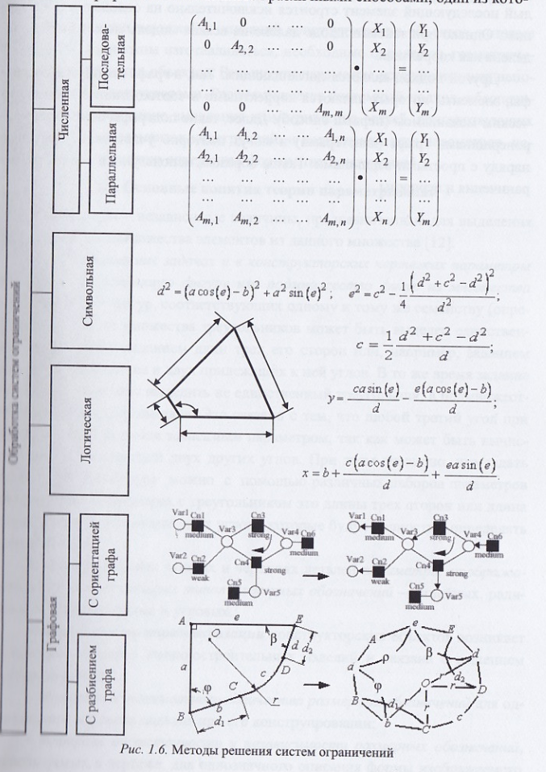

# Вопрос 54: Полнота системы ограничений и методы разрешения системы ограничений, используемых в конструкторских САПР.

## Полнота системы ограничений.

Система ограничений, применяемая к конкретной модели, также имеет определенное значение. Она может быть:
- **неполной**, неопределенные параметры могут принимать бесконечное число значений => при модификации модели может быть построенно бесконечное число вариантов модифицированного объекта;
- **правильный выбор для формирование модели, однозначно соотв. исходному заданию параметров этой модели** **полной**, система может построить единственный вариант модифицированного объекта, точно соотв. заданным конструктором значениями задающих параметров;
- **избыточной**, в описании модели объекта имеются лишнии, зависимые от других параметров ограничения. Их можно либо удалить из общего списка и построить единств. вариант модифицированного объекта, либо оставить в описании модели. В последнем случае нужно доп. размерных обочночения использовать как справочные, иначе модель будет неработоспособной как неправильно сформированная. То есть система не сможет осуществ. модификацию объекта и вывод соотв. изображения. Значения справочных размеров при модификации изображения могут противоречить управляющим и вводить в заблуждение конструктор, если не применять соотв. средства автомат. коррекции их значений при преобразовании.
***
## Решение системы ограничений

### Двумерное пространство
- ***Численные методы***: перевод огранчений в форму алгебраических уравнений и решение ее итерационным численным методом (Ньютона-Котеса, Гауса, Крамера, ...)
    - **Достоинства**: возможность решения избыточных систем ограничений при условии взаимной непротиворечивости отдельных ограничений.
    - **Недостаток**: ирациональный метод может найти только единственное решение из множества вариантов. Сходимость зависит от начальной конфигурации модели.
    - **Применение**: к моделям, полученные в ходе мягкой или жесткой параметризации.

- ***Символьные методы***: Система уравнений решается не численными методами, а в общем виде. Далее, при подстановке конкретных значений в выражения, полученные в ходе решения задачи, получают вариант конфигурации объекта.
   - **Недостаток**: система уравнений должна быть независима, иначе решение не будет найдено.
   - **Применение**: обработка жестких параметрических моделей.

- ***Логические методы***: Решение системы ограничений применяются правила логического вывода.

 **Состав примитивов объекта**: точки, линии, векторы и треугольники.

 **Допустимые отношения**: расстояние между двумя точками, углы между линиями либо 2 угла треугольника.

 **Примитивы + отношения = система предикатов**, после чего применяются правила евклидовой геометрии построения.

 - **Достоинства**: избавление от необходимости решения больших систем уравнений.
 - **Недостатки**: своеобразность построения моделей, ограниченный состав примитивов, применимость только для решения сравнительно небольших задач.

- ***Графовые методы***:
   - **С ориентацией графа**: один из ранних подходов решения системы ограничений для построения моделей объектов.
      1. Строится система уравнений.
      + В уравнениях выделяются константы и переменные.
      + Строится неориентированный граф, **вершины** которого соотв. сами уравнения, а также переменные и константы. **Ребра** указывают принадлежность констант и переменных к уравнениям.
      + Выполняется задача ориентации графа, начиная с вершины-констант.

   - **С разбиением графа**: один из прогрессивных методов.

   Вершины графа соотв. приметивам модели, а ребра - отношения между элементами.
      1. **Этап анализа**: Определяется характер системы ограничений. Она должна быть полной (необходимое условие).
      2. **Этап построения**: Генерация модели в виде последовательного нахождения пространственного положения примитивов.

   - **Анализ графа**
      1. Хронологический механизм моделирования: каждый последующий элемент строится исключительно на основании предыдущих. Но не всякая модель может быть определенна как корректная.
      2. Поглащение: в графе находятся подграфы, элементы которых являются корректными в соотв. с хронологическим механизмом (Первый способ). Далее подграфы считаются макровершинами графа (кластерами) и могут быть повторно участвовать в анализе наряду с простыми вершинами. Таким образом, используются все ребра, ограничения и вершины.

      
