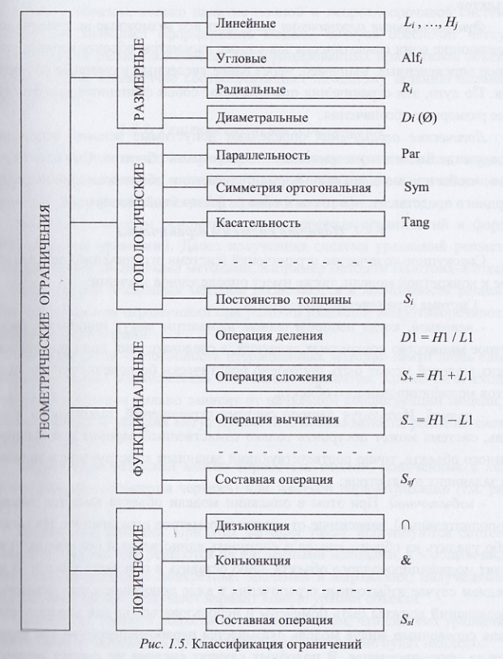

# Вопрос 6: Ограничения, используемые в системах параметризации. Полнота системы ограничений.

## Ограничения, используемые в системах параметризации.

***Ограничением*** называется любое условие построения модели, связывающее положение или форму отдельного примитива относительно других.

***Совокупность примитивов объекта и ограничений*** полностью определяет параметрическую модель объекта.

Виды ограничений:

- ***Размерные***

   Объединяют совокупность размеров, численные значения которых задают положение базовых точек примитивов графического объекта относительно выбранной системы координат или ранее определенных примитивов этого объекта.

   **Например**: линейные, радиальные, диаметральные и угловые.

- ***Топологические***

   Определяют условия взаимосвязи графических примитивов и тем самым наряду с другими типами ограничений влияют на форму объекта.

   **Сюда относят**: условия совпадения точек у разных примитивов, условия касания примитивов, их параллельность расположения, перпендикулярность, соостность, симметрию.

   **К этому виду ограничений относят** принадлежность примитивов определенному виду, эквивалентность размеров отрезков, радиусов дуг и окружностей, постоянство толщины детали и др.

   Вводимые топологические ограничения уменьшают количество размерных ограничений, необходимых при создании параметрческих описаний моделей конструкторских объектов.   

- ***Функциональные***

   Включают все возможные выражения, определяющие одни семантически зависимые параметры объекта через другие, ранее определенные. Ограничения представляют собой функционально задаваемые размерные обозначения.

- ***Логические***

   Определяют допустимые условия отношений между отдельными геометрическими параметрами объектов. Они служат для того, чтобы при модификации форма получаемого объекта не принимала абсурдного представления с точки зрения ее физической реализации.

## Полнота системы ограничений.

Система ограничений, применяемая к конкретной модели, также имеет определенное значение. Она может быть:
- ***неполной***, неопределенные параметры могут принимать бесконечное число значений => при модификации модели может быть построенно бесконечное число вариантов модифицированного объекта;
- ***правильный выбор для формирование модели, однозначно соотв. исходному заданию параметров этой модели*** ***полной***, система может построить единственный вариант модифицированного объекта, точно соотв. заданным конструктором значениями задающих параметров;
- ***избыточной***, в описании модели объекта имеются лишнии, зависимые от других параметров ограничения. Их можно либо удалить из общего списка и построить единств. вариант модифицированного объекта, либо оставить в описании модели. В последнем случае нужно доп. размерных обочночения использовать как справочные, иначе модель будет неработоспособной как неправильно сформированная. То есть система не сможет осуществ. модификацию объекта и вывод соотв. изображения. Значения справочных размеров при модификации изображения могут противоречить управляющим и вводить в заблуждение конструктор, если не применять соотв. средства автомат. коррекции их значений при преобразовании.
***
