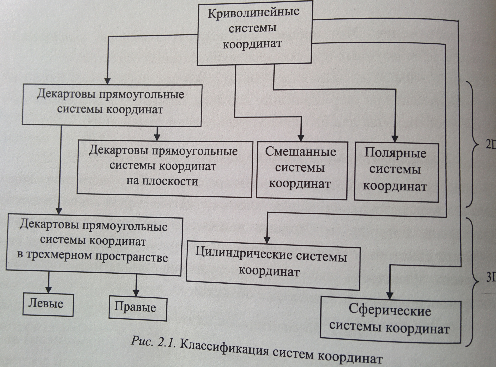
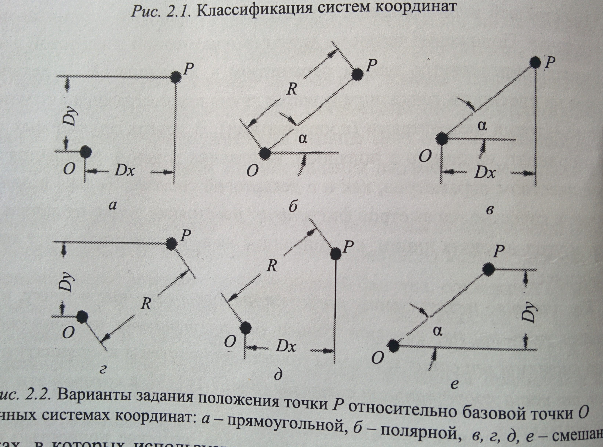
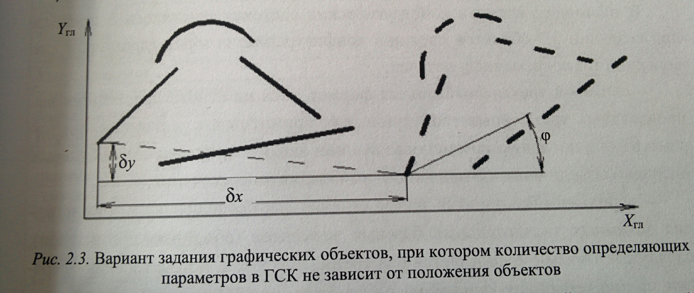
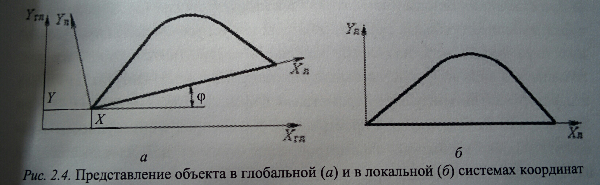

# Вопрос 8: Параметризация отдельных плоских графических примитивов (точки, отрезка, окружности, дуги и т.д.).

В процессе конструкторского проектирования любого геометрического объекта его параметризация осуществляется с целью определения параметров (размеров), которые необходимо нанести на строящееся изображение. В результате конструирования должно быть построено геометрически и параметрически правильное изображение, несущее информацию, достаточную для воспроизведения представленного объекта.

# Параметризаиция точки.

Простейшей непроизводной геометрической фигурой (примитивом) является точка. Положение точки на линии (в одномерной декартовой системе координат) определеяется одним параметром - координатой. В декартовой системе на плоскости точка определяется двумя параметрами, а в трёхмерной – тремя.

Количество независимых параметров, определяющих точку, и более сложные примитивы, зависит только от размерности используемой для этого системы описания (системы отсчёта или системы координат) и не зависит от типа координатной системы, в которой элементы описываюся.

Зная количество независимых параметров, которые полностью описывают примитив в двухмерной системе, нетрудно найти число параметров, необходимых для определения того же типа в другой системе описания.

Задание положения точки в чертежах обеспечивается двумя независимыми параметрами. В чертежах, в которых используетс смешанная система координат (и ортогональная, и полярная), задать положение точки можно с помощью четырёх типов размерных обозначений – вертикального, горизонтального, наклонного и углового. При этом положение точки на плоскости может быть заданоразличными способами (вариантами) с учётом возможных видов размерных обозначений, используемых для её задания. Общее количество варинатов заданий точки, таким образом, определяется числом сочетаний двух разменых обозначений из четырёх возможных ( = 6 ), то есть точка может быть определена шестью разными способами (алгоритмами).

Классификация систем координат:

Варианты задания положения точки:

# Задание сложных графических примитивов.

Задание других графических примитивов можно рассматривать как совокупное задание их характерных точек. Соответственно, количество вариантов заданий сложных графических объектов во много раз превышает количество вариантов задания одиночной точки.

Для задания отрезка требуется определить две точки – начальную и конечную – 4 параметра. При этом число вариантов задания отрезка на плоскости с помощью независимых размерных обозначений = 2 * C(4, 2) * C(4, 2) = 72.

Задание окружности на плоскости, которая является симметричной фигурой, требует трёх параметров – двух для задания положения её центра и третьего – для определения радиуса окружности.

Произвольная дуга окружности определяется тремя характерными точками – центром окружности, образующей дугу, а также точками начала и конца дуги. При это для однозначности представления дуг вводится дополнительное условие – они должны формироваться против часовой стрелки от начальной точки к конечной. Это условие учитывается в структурах данных всех графических систем и позволяет отличить формируемую дугу от её дополнения до образующей её окружности. По сути, это условие является дополнительным ограничением, накладываемым на описание дуг в графических системах. Таким образом, учитывая необходимость задания трёх точек и условие нахождения точек начала и конца дуги на одинаковом расстоянии от центра, для однозначного описания дуги требуется 5 независимых (по две для задания центра и начальной точки и одна для конечной точки).

Эллипс в общем случае задаётся пятью параметрами (координатами центра, значениями длины двух полуосей и угла наклона его главной оси к оси координат).

Дуга эллипса, соответственно, требует для задания на два параметра больше, чем образующий её эллипс.

Аналогичным образом можно определить количество необходимых параметров для задания других базовых геометрических графических примитивов, используемых при формировании чертежей, таких, как полилиния, проходящая через n точек, парабола, гипербола и т.д.

Для полного задания сплайнов, задаваемых n точками, требуется 2n параметров в двухмерной (или 3n в трёхмерной) системе, которые определяют положение этих точек, плюс k дополнительных параметров или ограничений, определяемых типом формируемого сплайна.

Приведённый расчёт количества необходимых параметров осуществляется при условии задания графических элементов в глобальной системе координат. При этом считалось, что соответствующие элементы находятся в произвольном месте плоскости изображения, т.е. количество требуемых параметров описания не зависит от перемещения и вращения элементов на плоскости, но их значения могут изменяться при этом на постоянные величины по координатам X и/или Y – на dx и/или dy и по углу phi.

Вариант задания графических объектов, при котором количество определяющих параметров в ГСК не зависит от положения объектов.

Такую параметризацию сложных графических объектов (процесс определения количества и типа независимых параметров, которые полностью определяют соответствующих графический объект) называют параметризацией с точностью до движения.

Часто проще задавать параметры не в ГСК, а в локальной системе координат, которая непосредственно связана с самим элементом изображения. В таких случаях параметры определяют формы фигуры. Поэтому в ЛСК параметризация осуществляется с точностью до формы фигуры, а параметры, используемые при этом, являются параметрами формы. Такая форма определения необходимого количества параметров используется в чертежах при простановке в них размерных обозначений. В ЛСК количество требуемых для описания параметров на плоскости по сравнению с ГСК обычно уменьшается на три. Эти три параметра можно рассматривать как параметры, определяющие положение самой ЛСК в ГСК. Одна из осей ЛСК обычно совпадает с направлением какого-либо отрезка или с положением оси симметрии описываемой фигуры.

Представление объекта в ГСК и ЛСК

