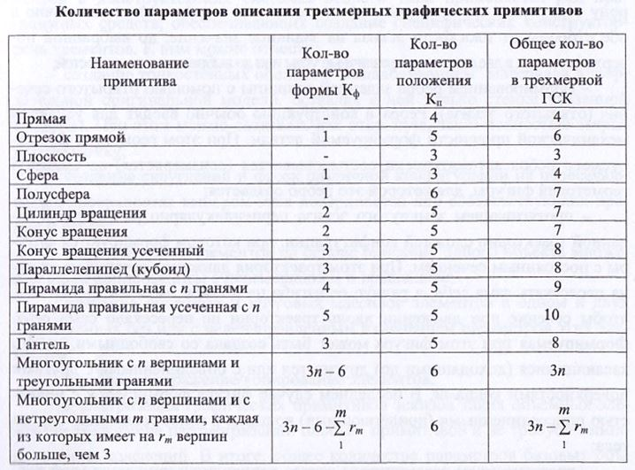

# Вопрос 9: Параметризация объемных графических примитивов (базовых трехмерных примитивов)

В настоящее время в конструкторских системах сложилось 3 подхода при создании ЗО-объектов сложной конфигурации, которая характерна для большинства современных деталей:
- сложный трехмерный объект формируется на основе простейших непроизводных
трехмерных геометрических примитивов с управляемыми параметрами
и последующим использованием над этими примитивами булевых
операций объединения (склеивания), вычитания и пересечения;
- использование понятия эскиза сечения для последующего формирования
объемных твердотельных базовых элементов (объемных примитивов),
наряду с которыми используется ряд специфических конструкторских операций,
применяемых для дальнейшего формирования 3 D-моделей деталей с целью
эффективного получения их требуемой формы;
- использование в одной системе обоих подходов на разных этапах для
создания трехмерной модели требуемой детали.

### Параметриизация независимых трехмерных примитивов
В качестве графических независимых трехмерных фигур обычно используют базовые элементы различной конфигурации, набор которых определяется на основе разложения на отдельные простейшие трехмерные примитивы различных конструкторских деталей всевозможного назначения. В качестве таких базовых примитивов в конструкторских ( ’ЛИР используют параллелепипед (кубоид), призму, цилиндр, конус, усеченный конус, усеченную пирамиду, сферу, полусферу или часть сферы, гантель, проточки всевозможного вида и другие независимые (пспрон анодные) фигуры (НФ). Все эти фигуры характеризуются параметрами формы К_ф (при описании в ЛСК) и параметрами их положения в пространстве К_п которые в совокупности определяют общее количество параметров, необходимых для их однозначного определения в трехмерном пространстве (см. таблицу).

При использовании подобных НФ для создания единой составной фигуры возникает задача их объединения, решая которую необходимо учитывать отношения, возникающие между этими НФ (например, отношения склеивания, пересечения и вычитания).

### Параметризация объемных примитивов, создаваемых на основе их сечений
При втором подходе формирование сложных объемных деталей базируется, в основном, на различных принципах использования предварительно создаваемого 2D-эскиза сечения. Такие базовые элементы могут создаваться:
- вытягиванием эскиза перпендикулярно его плоскости на заданную глубину (с добавлением или с удалением материала). При этом глубина вытягивания может задаваться различными способами - на заданное значение, на заданное значение симметрично относительно плоскости эскиза, до следующей или до выбранной поверхности, а также в обе стороны на разную глубину,
- вращением эскиза вокруг оси, лежащей в плоскости эскиза, с целью добавления или удаления материала в соответствии с формируемой при этом базовой фигурой. Эскиз должен быть замкнутым, располагаться по одну сторону оси, а угол его вращения может задаваться в одну или симметрично в обе стороны от плоскости эскиза на заданное значение, до выбранной поверхности
или в две стороны на различные углы или до выбранных поверхностей;
- формированием ребра заданной толщины с помощью открытого сечения (открытого эскиза). Ребра в конструкцию обычно вводят для усиления механической прочности формируемой детали. При этом геометрия формируемого ребра автоматически состыковывается (соизмеряется) со смежной геометрией фигуры, для которой это ребро создается;
- протягиванием замкнутого эскиза перпендикулярно разомкнутой заданной траектории сложной конфигурации, при котором формируются фигуры с постоянным сечением. При этом траектория движения сечения не должна пересекать сама себя, а радиус ее изгиба не должен быть настолько мал, чтобы сечение при движении вдоль траектории не пересекало само себя. Формируемая при этом фигура может быть создана со свободными, только касающимися (доходящими до) других тел или с объединенными с другими
поверхностями концами. В последнем случае фигура формируется с полностью присоединенными (прилегающими) концами к ранее созданным частям тела;
- протягиванием разомкнугого эскиза перпендикулярно замкнутой траектории без создания или с созданием внутренней поверхности;
- сопряжением нескольких ранее созданных параллельных сечений различной формы, которые характеризуются одинаковым числом вершин (одинаковым числом ребер у формируемой фигуры), для создания своеобразного выступа или выреза. Однако в виде исключения сопряжение может начинаться и заканчиваться точкой, т. е. начальное и конечное сечения допускаются в виде точки. При этом сопряжение заданных сечений может выполняться прямым (прямыми линиями) или сглаженным (гладкими линиями) способом. Формируемый выступ может создаваться как сплошное, так и как полое тело с определенной толщиной стенок;
- формированием отверстий различного профиля на плоскости или цилиндрической поверхности. При этом можно менять диаметр и задавать глубину отверстия различными способами - менять угол наклона сверла, диаметр и глубину цековки, угол и диаметр зенковки, а также создавать зенковки на выходе отверстия.

Наряду с использованием эскизов сечений для создания базовых элементов в конструкторских системах второго типа применяется ряд программных средств, обеспечивающих создание специфических конструкторских элементов. К ним можно отнести:
- создание тонкостенных оболочек “выдалбливанием” материала в твердотельной оригинальной модели, оставляя в ней только стенки указанной толщины. При этом можно создавать как открытую, так и полностью закрытую оболочку;
- создание скруглений и фасок различной конфигурации на пересекающихся поверхностях выбором этих поверхностей или соответствующих кромок и ребер;
- создание групп элементов на основе описания одного объекта множественным копированием с перемещением и вращением;
- создание линейных и круговых массивов элементов в одном и двух направлениях без или с целенаправленным изменением параметров этих элементов;
- зеркальное отражение/копирование элементов.

Параметризация графических примитивов эскизов таких объемных элементов аналогична параметризации плоских примитивов и не требует дополнительных пояснений. В итоге, общее количество параметров базовых объемных фигур, сформированных на основе различных действий над эскизами, складывается из двух составляющих - параметров, определяющих непосредственно сами эскизы плоских сечений, и параметров тех функций, которые обеспечивают формирование базовой ЗD-фигуры.
